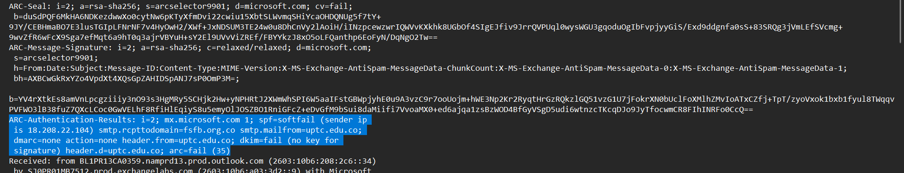

# PhishStrike Lab

**Difficulty:** Hard  
**Category:** Malware  
**Tools:** ANY.RUN, MalwareBazaar, URLHaus, VMRay, VirusTotal

---

## Q1: Identifying the sender's IP address with specific SPF and DKIM values

**Question:** What is the sender's IP address that has an SPF value of softfail and a DKIM value of fail?

### 📧 Understanding Email Security Protocols

**SPF (Sender Policy Framework)** và **DKIM (DomainKeys Identified Mail)** là hai giao thức bảo mật quan trọng cho email.

#### ✅ SPF (Sender Policy Framework) – Xác minh máy chủ gửi

SPF giúp kiểm tra xem **máy chủ gửi email** có được **ủy quyền** bởi **tên miền người gửi** hay không.

- Khi một email đến, máy chủ nhận sẽ kiểm tra bản ghi SPF của tên miền trong DNS
- Nếu máy chủ gửi không nằm trong danh sách được phép, email có thể bị đánh dấu là **giả mạo (spoofing)** hoặc spam

> 💡 **Ví dụ:** Nếu email có địa chỉ `support@example.com`, SPF sẽ kiểm tra xem máy chủ gửi có phải là máy chủ được `example.com` cho phép hay không.

#### ✅ DKIM (DomainKeys Identified Mail) – Bảo vệ nội dung email

DKIM sử dụng **chữ ký số** để đảm bảo rằng nội dung email không bị thay đổi kể từ khi được gửi đi.

- Người gửi ký điện tử nội dung email bằng khóa riêng
- Người nhận dùng **khóa công khai** (trong DNS) để xác minh chữ ký
- Nếu xác minh thất bại → nội dung có thể đã bị chỉnh sửa

> 💡 DKIM giống như một **tem chống giả** đảm bảo email không bị sửa đổi giữa đường.

### 🔍 Analysis

**Softfail** xảy ra khi địa chỉ IP của máy chủ gửi **không nằm trong danh sách được phép**, nhưng lại bị đánh dấu là **"không chắc chắn"** thay vì bị từ chối ngay.

**DKIM failure** cho thấy:
- Không có chữ ký DKIM, hoặc
- Chữ ký không đúng (bị chỉnh sửa, không khớp khóa công khai)

**Answer:** `[IP Address from screenshot]`

---

## Q2: Understanding the return path

**Question:** What is the return path specified in this email?

### 📬 What is Return-Path?

**Return-Path** là tiêu đề (header) trong email chỉ ra **địa chỉ nhận phản hồi lỗi (bounce-back)** nếu email không thể gửi được.

> ⚠️ **Lưu ý:** Return-Path có thể không phải là địa chỉ người gửi thực sự!

**Answer:** `[Return path from screenshot]`

---

## Q3: Malware distribution server

**Question:** What is the IP address of the server hosting the malicious file related to malware distribution?

Sử dụng **VirusTotal** để xác định file malicious.

**Answer:** `[IP Address from analysis]`

---

## Q4: Cryptocurrency mining malware

**Question:** Which malware family is responsible for cryptocurrency mining?

### 🔎 URLhaus Analysis

Malware family chuyên cryptocurrency mining được xác định là **CoinMiner**.

**Answer:** `CoinMiner`

---

## Q5: Malware URL requests

**Question:** Based on the previous analysis of the cryptocurrency malware sample, what does this malware request the URL?

### 🔬 VMRay Analysis

Hash: `453fb1c4b3b48361fa8a67dcedf1eaec39449cb5a146a7770c63d1dc0d7562f0`

URL được tìm thấy trong phần **Network Analysis**.

**Answer:** `[URL from network analysis]`

---

## Q6: BitRAT persistence mechanism

**Question:** Based on the BitRAT malware sample analysis, what is the executable's name in the first value added to the registry auto-run key?

Kiểm tra trong mục **IOC → Registry** để tìm executable name.

**Answer:** `[Executable name from registry]`

---

## Q7: Downloaded file hash

**Question:** Based on the BitRAT analysis, what is the SHA-256 hash of the file previously downloaded and added to the autorun keys?

Thông tin này được tìm thấy tương tự như câu Q6.

**Answer:** `[SHA-256 hash]`

---

## Q8: BitRAT loader HTTP request

**Question:** What is the URL in the HTTP request used by the loader to retrieve the BitRAT malware?

### 🔍 AsyncRAT Analysis

**Answer:** `[URL from HTTP request]`

---

## Q9: PowerShell execution delay

**Question:** What is the delay (in seconds) caused by the PowerShell command according to the BitRAT analysis?

**Answer:** `[Delay in seconds]`

---

## Q10: BitRAT C2 domain

**Question:** What is the C2 domain used by the BitRAT malware?

### 🌐 Command and Control Infrastructure

Tracking C2 domains là essential cho việc detecting và blocking malicious activities.

**Answer:** `[C2 domain]`

---

## Q11: AsyncRAT data exfiltration

**Question:** According to the AsyncRAT analysis, what is the Telegram Bot ID used by this malware?

Thông tin được tìm thấy trên **VMRay analysis**.

**Answer:** `[Telegram Bot ID]`

---

## 🎯 Key Takeaways

- **Email security protocols** (SPF, DKIM) are crucial for identifying phishing attempts
- **Multi-tool analysis** (VirusTotal, URLhaus, VMRay) provides comprehensive malware insights
- Understanding **persistence mechanisms** helps in effective malware removal
- Tracking **C2 infrastructure** and **data exfiltration channels** is essential for threat mitigation

---