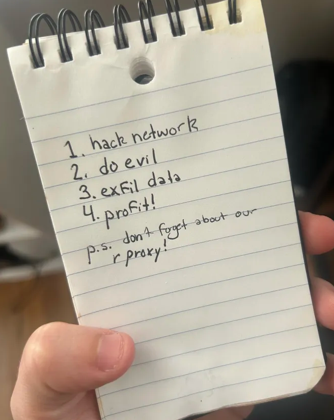

# Evil PCAP

**Difficulty:** Medium
**Category:** Network  
**Tools:** Wireshark, tshark

---
Đây là một challenge ctf forensics từ idek ctf 2025.
## 🔍 Initial Analysis


Phân tích traffic ban đầu cho thấy:
- User-Agent `my-python-requests-useragent` với `/instructions.png` → trả về **200 OK**
- User-Agent `curl` với `/password` → **bị chặn**

---

## 🔓 Bypassing User-Agent Restriction

### Extracting Password

```bash
┌──(nqghuy㉿DESKTOP-AJTP5JK)-[~]
└─$ curl --help | grep -u 'user-agent'
grep: warning: --unix-byte-offsets (-u) is obsolete
 -A, --user-agent <name>     Send User-Agent <name> to server
```

Sử dụng User-Agent chính xác để bypass:

```bash
┌──(nqghuy㉿DESKTOP-AJTP5JK)-[~]
└─$ curl -A "my-python-requests-useragent" http://143.198.13.84:80/password.txt
verysecureidek2025themedpassword
```

✅ **Password obtained:** `verysecureidek2025themedpassword`

---

## 📋 Understanding Instructions



---

## 🌐 Proxy vs Reverse Proxy

### ✅ **Proxy (Forward Proxy)**

- Là **máy trung gian giữa client (người dùng)** và **server (máy chủ)**
- Client gửi request → Proxy nhận và chuyển tiếp đến server → Trả kết quả về client

#### 📌 Mục đích của Proxy:

- **Ẩn IP** thật của client
- **Bypass firewall / chặn nội dung**
- **Lọc nội dung**, giám sát truy cập
- **Tăng tốc truy cập** (bằng cache)

---

### ✅ **Reverse Proxy**

- Là **máy trung gian đứng phía trước server**, đóng vai trò như **cửa ngõ**
- User gửi request → Reverse Proxy nhận trước → Chuyển đến backend server

#### 📌 Mục đích của Reverse Proxy:

- **Phân phối tải (load balancing)** giữa nhiều server
- **Ẩn thông tin backend server** (IP, cấu trúc thực tế)
- **Cache nội dung**, giảm tải cho server
- **Thêm lớp bảo mật** (lọc request dựa trên IP, User-Agent,...)
- **SSL termination** (mã hóa HTTPS chỉ thực hiện ở proxy)

---

### 📊 So sánh Proxy vs Reverse Proxy

| Thuộc tính | Proxy (Forward) | Reverse Proxy |
|-----------|-----------------|---------------|
| **Đứng giữa** | Client và Server | Internet và Server nội bộ |
| **Ẩn IP của** | Client | Server |
| **Dùng để** | Tránh kiểm duyệt, ẩn danh | Bảo mật, cân bằng tải, caching |
| **Ví dụ thực tế** | Tor, VPN | Nginx, HAProxy, Cloudflare |

> **Note:** Reverse Proxy thường được server dùng để **kiểm soát request**, ví dụ: chỉ cho phép một số User-Agent truy cập tài nguyên, lọc theo IP, header, cookie...

---

## 🔬 Analyzing Suspicious Requests with tshark

### Extracting HTTP Requests

```bash
┌──(nqghuy㉿DESKTOP-AJTP5JK)-[/mnt/e/CTF/misc/soc-intern-tasking/attachments]
└─$ tshark -r evil.pcapng -Y 'http.user_agent contains "my-python-requests"' -Tfields -e http.request.uri
/instructions.png
/instructions.png
/%1F
/%01
/%17
/%12
/%08
/%11
/instructions.png
/%0B
/D
/%1C
/%0E
/X
/%0A
/%02
/4
/%5E
/%01
/Y
/%06
/%2B
/%09
/%3A
/%1F
/V
/%00
/%2F
/%15
/%40
/%12
/%1A
/%0A
/%00
/%19
```

#### 📚 tshark Parameters:

- `-r <infile>`: Read from capture file
- `-Y <display filter>`: Apply display filter
- `-T fields`: Output format as fields
- `-e <field>`: Field to print (e.g., `http.request.uri`)

---

### Filtering and Cleaning Data

```bash
┌──(nqghuy㉿DESKTOP-AJTP5JK)-[/mnt/e/CTF/misc/soc-intern-tasking/attachments]
└─$ tshark -r evil.pcapng -Y 'http.user_agent contains "my-python-requests"' \
    -Tfields -e http.request.uri | grep -v "instructions.png" | sed 's/[\/%]//g'
1F
01
17
12
08
11
0B
D
1C
0E
X
0A
02
4
5E
01
Y
06
2B
09
3A
1F
V
00
2F
15
40
12
1A
0A
00
19
```

#### 📚 sed Command Breakdown:

| Thành phần | Ý nghĩa |
|-----------|---------|
| `s/.../.../g` | Substitute (thay thế) trong `sed` |
| `[\/%]` | Regex khớp với `/` hoặc `%` |
| `//` | Thay bằng chuỗi rỗng → **xóa** các ký tự khớp |
| `g` | Global – thay tất cả các ký tự khớp trên mỗi dòng |

> **Note:** Nếu bỏ `g`, chỉ xóa 1 ký tự đầu tiên trên mỗi dòng.

---

### Combining All Values

```bash
┌──(nqghuy㉿DESKTOP-AJTP5JK)-[/mnt/e/CTF/misc/soc-intern-tasking/attachments]
└─$ tshark -r evil.pcapng -Y 'http.user_agent contains "my-python-requests"' \
    -Tfields -e http.request.uri | grep -v "instructions.png" | sed 's/[\/%]//g' | tr -d '\n'
1F01171208110BD1C0EX0A0245E01Y062B093A1FV002F1540121A0A0019
```

**Command explanation:**
- `tr -d '\n'`: Xóa tất cả newline characters → ghép thành 1 dòng

---

## 🔐 Decoding the Payload

### Converting Non-Hex Characters

Chuyển đổi các ký tự `D, X, 4, Y, V` sang hex:


| Character | ASCII Code | Hex |
|-----------|-----------|-----|
| D | 68 | 44 |
| X | 88 | 58 |
| 4 | 52 | 34 |
| Y | 89 | 59 |
| V | 86 | 56 |

### Final Hex String

```
1F01171208110B441C0E580A02345E0159062B093A1F56002F1540121A0A0019
```


---

## 📝 Summary

Challenge này minh họa:
- **Reverse Proxy filtering** dựa trên User-Agent
- **Data exfiltration** thông qua HTTP URIs
- **Hex encoding** để ẩn giấu thông tin
- Sử dụng **tshark** để phân tích PCAP files
- **Command-line data processing** với sed, grep, tr

**Key Takeaways:**
- Luôn kiểm tra User-Agent restrictions
- HTTP URIs có thể chứa dữ liệu ẩn
- Kết hợp nhiều công cụ CLI để xử lý data hiệu quả