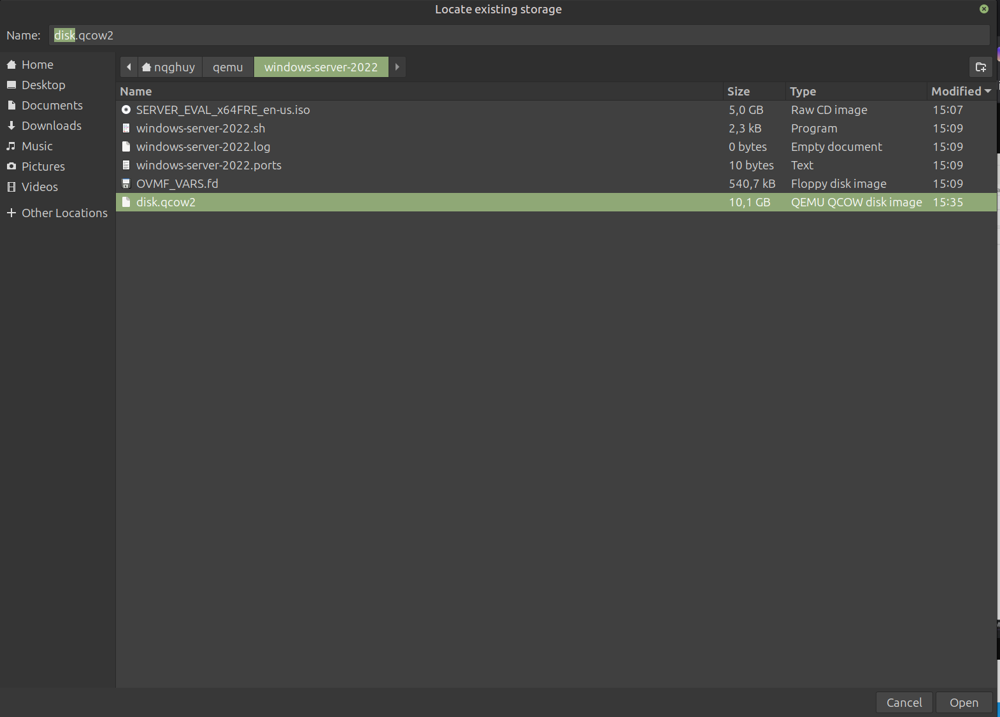

<!--  -->
## Giới thiệu

**Difficulty**: Medium  
**Category**: Endpoint  
**Tools**: guestmount

Bài lab phân tích ổ đĩa ảo VMware để tìm flag. Đến từ rootme
## Statement
Your company has lost access to an old server, unfortunately it contains important files, it is up to you to find them.

## Phân tích

```bash
┌──(nqghuy㉿kali)-[~/forensics/ch33]
└─$ file * 
root-disk001.vmdk: VMware4 disk image
root.ova:          POSIX tar archive
root.ovf:          XML 1.0 document, ASCII text, with very long lines (437)
```

Đầu tiên ta thấy file root.ova là file tar, ta tiến hành extract

```bash
tar -xvf root.ova
```

## Cài đặt libguestfs-tools

```bash
sudo apt install libguestfs-tools
```

### libguestfs-tools là gì?

`libguestfs-tools` là một bộ công cụ trên Linux để **làm việc với ổ đĩa ảo** (disk images, như `.qcow2`, `.vmdk`, `.vdi`, `.img`). Nó cho phép bạn xem, chỉnh sửa và quản lý nội dung của các máy ảo mà **không cần khởi động** chúng.

Một số công cụ chính:

- **`guestfish`** – shell để làm việc với image (copy file, chỉnh sửa, tạo phân vùng,…).
- **`virt-copy-in` / `virt-copy-out`** – copy file vào/ra image.
- **`virt-resize`** – resize disk image.
- **`virt-df`** – xem dung lượng các partition trong image.
- **`guestmount`** – mount image như một filesystem để thao tác như với thư mục bình thường.

### guestmount là gì?

`guestmount` là một tiện ích trong `libguestfs-tools` cho phép bạn **mount một disk image** (VD: `ubuntu.qcow2`) trực tiếp vào hệ thống host. Khi mount xong, bạn có thể `cd` vào đó và làm việc với các file y như trên ổ đĩa thật.

## Mount disk image

```bash
┌──(nqghuy㉿kali)-[~/forensics/ch33]
└─$ sudo guestmount -a root-disk001.vmdk -i -ro mnt
guestmount: you must specify a mountpoint in the host filesystem
```

**Các tham số:**
- `-a|--add image`: Add image
- `-i|--inspector`: Automatically mount filesystems
- `--ro`: read only, để mount an toàn

```bash
sudo guestmount -a root-disk001.vmdk -i -ro mnt
```

## Tìm flag

```bash
┌──(nqghuy㉿kali)-[~/forensics/ch33]
└─$ sudo cat mnt/root/.passwd                       
Bravo voici le flag :

F1aG-M3_PlEas3:)

Congratulation ! You may validate using this flag 

F1aG-M3_PlEas3:)
```

**Flag**: `F1aG-M3_PlEas3:)`

## Tham khảo

- [libguestfs Tools](https://libguestfs.org/)