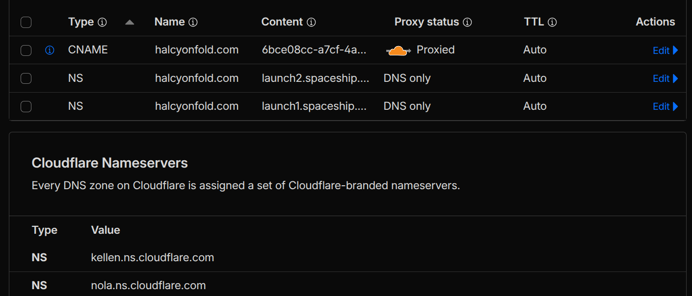
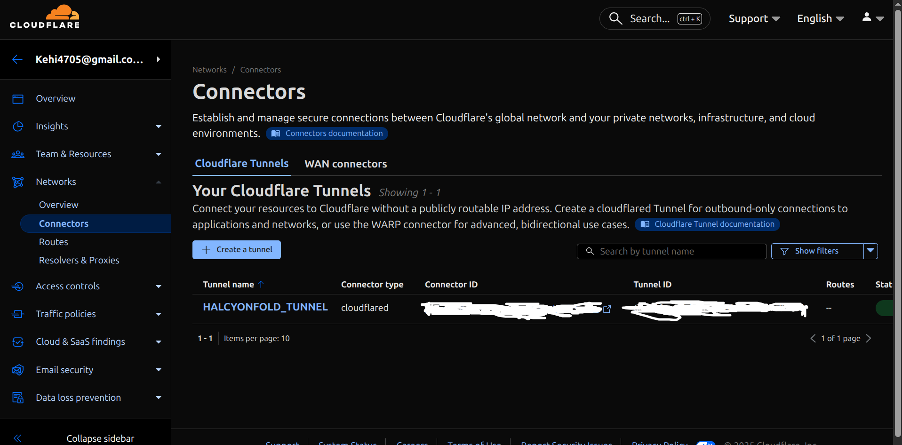
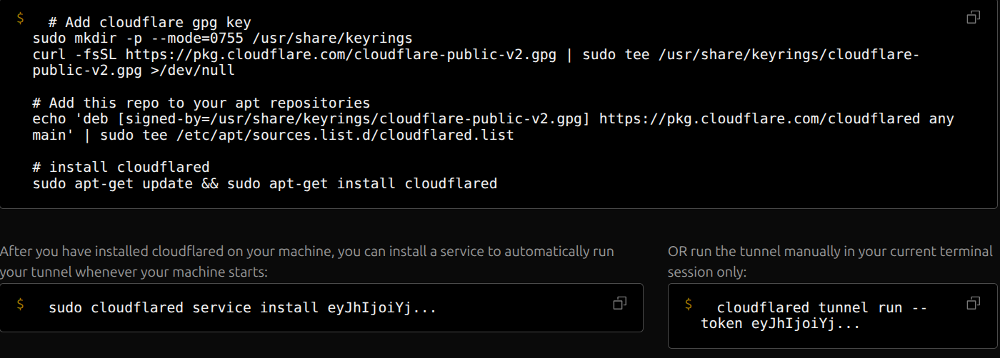
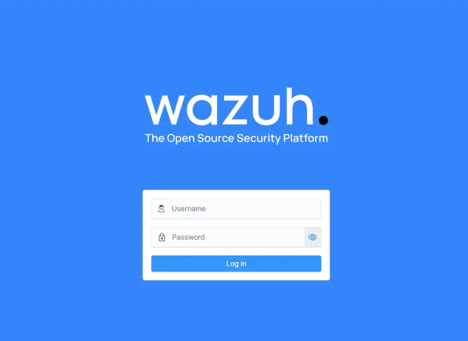
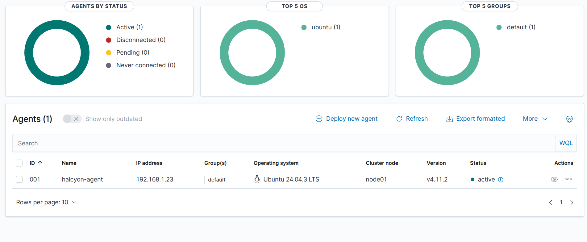
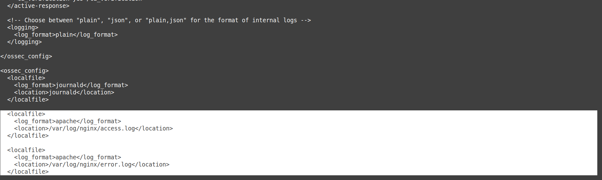
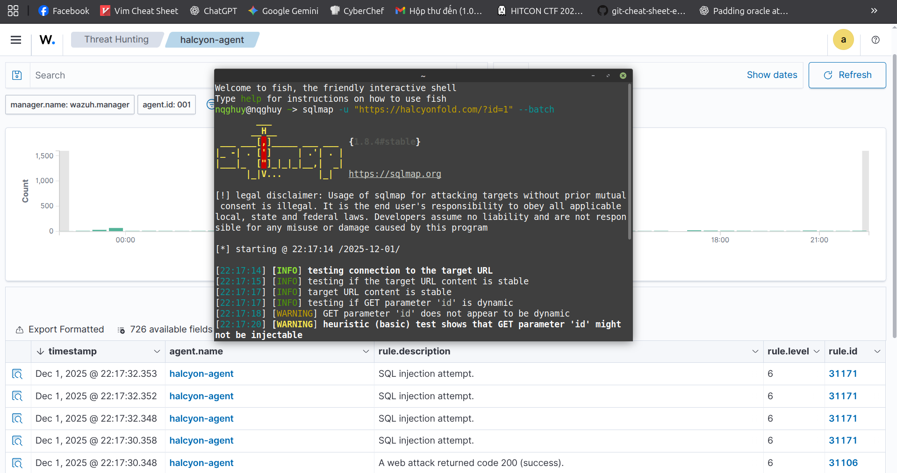
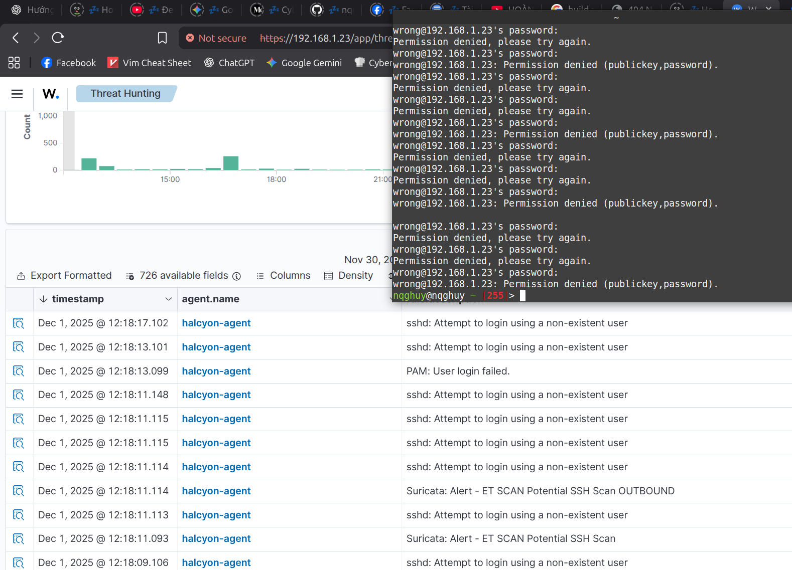
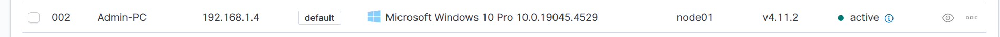
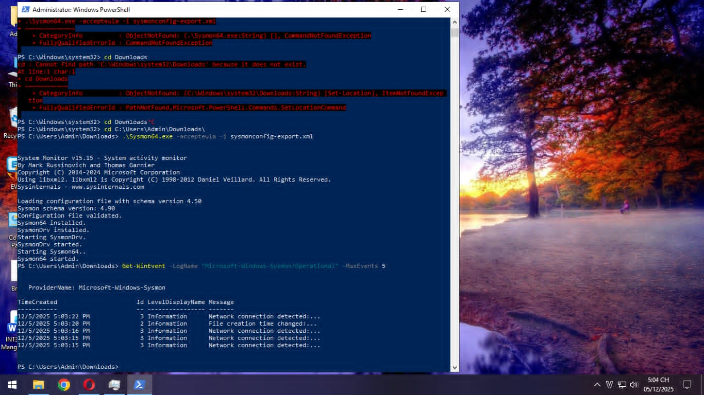

Bài viết chia sẻ quá trình xây dựng một web server và SOC homelab đơn giản tại nhà, bao gồm Wazuh (SIEM), Suricata (IDS), Sysmon và Shuffle (SOAR - sắp triển khai).

## Tổng quan

Với một chiếc laptop cũ và 1 PC không sử dụng, mình quyết định tận dụng nó để xây dựng:
- **Web Server** với Nginx
- **Wazuh** - SIEM platform
- **Suricata** - IDS/IPS
- **Shuffle** - SOAR (coming soon)
---

## 1. Xây dựng Web Server

### 1.1. Cấu hình IP tĩnh

Ban đầu, mình định host web bằng cách mở cổng router. Cấu hình trong `/etc/netplan/50-cloud-init.yaml`:

```yaml
network:
  version: 2
  wifis:
    wlp3s0:
      dhcp4: false
      addresses: [192.168.1.23/24]
      routes:
        - to: default
          via: 192.168.1.1
      nameservers:
        addresses: [1.1.1.1, 8.8.8.8]
      access-points:
        "HUY KHUONG":
          auth:
            key-management: "psk"
            password: "*******"
```

### 1.2. Cấu hình Nginx

Kết nối domain trong `/etc/nginx/sites-available/default`:

```nginx
server_name halcyonfold.com www.halcyonfold.com;
```

### 1.3. Sử dụng Cloudflare Tunnel

> **Vấn đề gặp phải:** VNPT chặn các cổng phổ biến (80, 443) và IP động thay đổi liên tục.
{: .prompt-warning }

**Giải pháp:** Sử dụng Cloudflare Tunnel để bypass các hạn chế này.

#### Cấu hình DNS


_Chuyển nameserver sang Cloudflare_

#### Tạo Tunnel


_Cấu hình Cloudflare Tunnel_

Chạy lệnh theo hướng dẫn:



---

## 2. Triển khai Wazuh

### 2.1. Giới thiệu

**Wazuh** là nền tảng bảo mật mã nguồn mở, kết hợp SIEM và XDR với 3 thành phần chính:

| Thành phần | Chức năng |
|------------|-----------|
| **Server** | Phân tích log, phát hiện mối đe dọa, quản lý agent |
| **Indexer** | Lưu trữ và tìm kiếm dữ liệu |
| **Dashboard** | Giao diện trực quan, biểu đồ |

### 2.2. Cài đặt

#### Kiểm tra Docker

```bash
docker compose version
# Output: Docker Compose version v2.40.3
```

#### Clone repository

```bash
git clone https://github.com/wazuh/wazuh-docker.git -b v4.11.2
cd wazuh-docker/single-node
```

#### Generate certificates

```bash
docker-compose -f generate-indexer-certs.yml run --rm generator
```

#### Khởi động

```bash
docker-compose up -d
```

#### Verify containers

```bash
sudo docker ps
```

```
CONTAINER ID   IMAGE                          PORTS                                              NAMES
dbcc4cc839ba   wazuh/wazuh-dashboard:4.11.2   0.0.0.0:443->5601/tcp                             single-node-wazuh.dashboard-1
e780f5c87c27   wazuh/wazuh-indexer:4.11.2     0.0.0.0:9200->9200/tcp                            single-node-wazuh.indexer-1
3fcd3e4f73bf   wazuh/wazuh-manager:4.11.2     0.0.0.0:1514-1515->1514-1515/tcp, 55000/tcp       single-node-wazuh.manager-1
```

### 2.3. Truy cập Dashboard


_Wazuh Dashboard interface_

> **Thông tin đăng nhập:** `admin` / `SecretPassword`
{: .prompt-info }

### 2.4. Thêm Agent


_Thêm agent đầu tiên (web server)_

#### Cấu hình Nginx log

Thêm vào `/var/ossec/etc/ossec.conf`:



### 2.5. Test SQL Injection


_Wazuh phát hiện SQL injection attack_

> Mặc dù traffic đi qua Cloudflare Tunnel, Nginx vẫn ghi log và Wazuh phân tích để đưa ra cảnh báo.
{: .prompt-tip }

---

## 3. Triển khai Suricata

### 3.1. Giới thiệu

**Suricata** là IDS/IPS mã nguồn mở với 2 chế độ:

| Chế độ | Mô tả | Loại |
|--------|-------|------|
| **AF_PACKET** | Kết nối trực tiếp card mạng, kernel copy traffic | IDS |
| **NFQUEUE** | Kết hợp iptables, có thể drop gói tin | IPS |

### 3.2. Cài đặt

```bash
sudo apt-get install software-properties-common
sudo add-apt-repository ppa:oisf/suricata-stable
sudo apt-get update
sudo apt-get install suricata
```

### 3.3. Cấu hình

#### Xác định network interface

```bash
ip a
```

```
2: wlp3s0: <BROADCAST,MULTICAST,UP,LOWER_UP>
    inet 192.168.1.23/24 brd 192.168.1.255 scope global wlp3s0
```

#### Cấu hình AF_PACKET

Sửa `/etc/suricata/suricata.yaml`:

```yaml
af-packet:
  - interface: wlp3s0
```

#### Cấu hình HOME_NET

```yaml
HOME_NET: "[192.168.1.0/24]"
```

### 3.4. Update Signatures

```bash
sudo suricata-update
```

> Rules được lưu tại `/var/lib/suricata/rules`
{: .prompt-info }

### 3.5. Khởi động

```bash
sudo systemctl restart suricata
```

### 3.6. Tích hợp với Wazuh

Thêm vào `/var/ossec/etc/ossec.conf`:

```xml
<localfile>
  <log_format>json</log_format>
  <location>/var/log/suricata/eve.json</location>
</localfile>
```

### 3.7. Test SSH Detection


_Suricata phát hiện SSH connection qua Wazuh_


## 4.  Thêm agent Windows
Dự định của mình là học thêm về cách viết signature cho 1 malware. Khi malware đấy xuất hiện trên Windows thì wazuh cảnh báo. (Note: vẫn chưa có viết signature)

Sau khi làm theo các bước cài đặt agent, Ta chỉnh sửa file config trên windows C:\Program Files (x86)\ossec-agent\ossec.conf

```
<server>
  <address>192.168.1.23</address>
  <port>1514</port>
</server>
```
Sau đó chạy file auth_wazuh.exe với ip là máy của wazuh server, cổng tương tự trong file ossec.conf


Ta đã thêm thành công

<!--  -->
Tiếp đến ta tiến hành cài sysmon cho windows và wazuh sẽ theo dõi log do sysmon tạo ra.

Sử dụng bản config nổi tiếng cho sysmon là https://raw.githubusercontent.com/SwiftOnSecurity/sysmon-config/master/sysmonconfig-export.xml
. Cuối cùng ta chạy
```
Sysmon.exe -accepteula -i sysmonconfig-export.xml
```

Để wazuh agent đọc được log của sysmon, ta cần cấu hình file ossec.conf
```
<localfile>
<location>Microsoft-Windows-Sysmon/Operational</location>
<log_format>eventchannel</log_format>
</localfile>
```
Tiến hành thả 1 malware vào windows

Ta đã thấy Wazuh đã bắt được event thành công
---

## Kết luận

Bài lab đã hoàn thành việc:
- ✅ Xây dựng web server với Cloudflare Tunnel
- ✅ Triển khai Wazuh SIEM với Docker
- ✅ Cài đặt Suricata IDS
- ✅ Tích hợp Suricata với Wazuh
- ✅ Tích hợp Sysmon với Wazuh
- 🔄 Shuffle SOAR (coming soon)


## Nguồn tham khảo

- [Wazuh Documentation](https://documentation.wazuh.com/)
- [Suricata User Guide](https://docs.suricata.io/)
- [Cloudflare Tunnel](https://developers.cloudflare.com/cloudflare-one/connections/connect-apps/)
- [Building a soc Lab at Home (PART 1)](https://medium.com/@linusobura/building-a-soc-lab-at-home-part-1-a638dec56f26)
- [
Integrating Suricata With Wazuh For Log Processing](https://www.youtube.com/watch?v=NB_u9m-MMcY)
- [Using Wazuh to monitor Sysmon events](https://wazuh.com/blog/using-wazuh-to-monitor-sysmon-events/)
---
