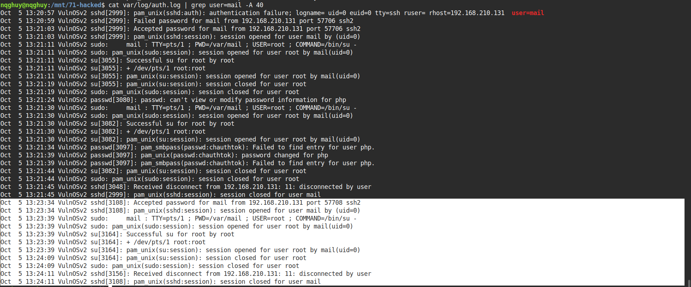

Writeup cho challenge **Hacked** trên CyberDefenders - một bài forensics Linux khá khó với E01 disk image, LVM và nhiều kỹ thuật phân tích hệ thống.

## Thông tin Challenge

| Thuộc tính | Giá trị |
|------------|---------|
| **Difficulty** | Hard |
| **Category** | Endpoint Forensics |
| **Tools** | RStudio, ewfmount, john, kpartx, LVM |
| **Platform** | [CyberDefenders](https://cyberdefenders.org/) |


---

## Phân tích E01 Image

### 1. Mount E01 File

**E01 (Expert Witness Format)** khác với `.img`/`.dd`:

| Đặc điểm | **E01** | **dd/raw** |
|----------|---------|------------|
| **Nén dữ liệu** | ✅ Hỗ trợ compression | ❌ Không nén |
| **Metadata** | ✅ Hash, timestamp, case info | ❌ Raw data only |
| **Chia file** | ✅ E01, E02, E03... | ❌ Single file |
| **Forensic standard** | ✅ Chuẩn EnCase | ⚠️ Generic format |

```bash
sudo ewfmount Webserver.E01 /mnt/ewf
```

> `ewf1` là **device-like file** - một view ảo đại diện cho toàn bộ disk image ở dạng raw.
{: .prompt-tip }

### 2. Phân tích Partition Table

```bash
sudo mmls /mnt/ewf/ewf1
```

```
DOS Partition Table
Offset Sector: 0
Units are in 512-byte sectors

      Slot      Start        End          Length       Description
000:  Meta      0000000000   0000000000   0000000001   Primary Table (#0)
001:  -------   0000000000   0000002047   0000002048   Unallocated
002:  000:000   0000002048   0000499711   0000497664   Linux (0x83)
003:  -------   0000499712   0000501759   0000002048   Unallocated
004:  Meta      0000501758   0066064383   0065562626   DOS Extended (0x05)
005:  Meta      0000501758   0000501758   0000000001   Extended Table (#1)
006:  001:000   0000501760   0066064383   0065562624   Linux LVM (0x8e)
007:  -------   0066064384   0066064607   0000000224   Unallocated
```

#### MBR vs GPT

| Tiêu chí | **MBR** | **GPT** |
|----------|---------|---------|
| **Năm ra đời** | 1983 | 2000s (UEFI) |
| **Dung lượng tối đa** | 2 TB | > 2 TB |
| **Số partition** | 4 primary (hoặc 3 + 1 extended) | 128 partitions |
| **Boot mode** | Legacy BIOS | UEFI |

### 3. Map Partitions với kpartx

```bash
sudo kpartx -a -v /mnt/ewf/ewf1
```

```
add map loop0p1 (253:0): 0 497664 linear 7:0 2048
add map loop0p2 (253:1): 0 2 linear 7:0 501758
add map loop0p5 (253:2): 0 65562624 linear 7:0 501760
```

> **kpartx** = **k**ernel **part**ition ma**p** e**x**tension  
> Tạo device mapper nodes trong `/dev/mapper/` từ partition table
{: .prompt-info }

---

## LVM Analysis

### LVM Architecture


| Component | Chức năng |
|-----------|-----------|
| **PV** (Physical Volume) | Block device vật lý |
| **VG** (Volume Group) | Nhóm các PV thành một pool |
| **LV** (Logical Volume) | Phân vùng logic trong VG |

### Scan Logical Volumes

```bash
sudo lvscan
```

```
ACTIVE '/dev/VulnOSv2-vg/root' [30.00 GiB]
ACTIVE '/dev/VulnOSv2-vg/swap_1' [768.00 MiB]
```

### Mount Root Filesystem

```bash
sudo mount -o ro,noload /dev/VulnOSv2-vg/root /mnt/linux
```

> `-o ro,noload`: Read-only + không load journal (bảo toàn evidence)
{: .prompt-warning }

---

## Q&A Solutions

### Q1: System Timezone

```bash
cat /mnt/71-hacked/etc/timezone
```

**Answer:** `Europe/Brussels`

---

### Q2: Bruteforce Target User

```bash
cat var/log/auth.log | grep "authentication failure" | tail -1
```

```
Oct 5 13:20:57 VulnOSv2 sshd[2999]: pam_unix(sshd:auth): 
  authentication failure; logname= uid=0 euid=0 tty=ssh 
  ruser= rhost=192.168.210.131 user=mail
```

**Answer:** `mail`

---

### Q3 & Q4: Attack Duration


_SSH bruteforce attack timeline_

- **Total attempts:** `57708`
- **Duration:** `1 minute`

---

### Q5: Login Service

**Answer:** `sshd`

---

### Q6: Attack Type

**Answer:** `brute-force`

---

### Q7: IPs in lastlog

```bash
lastlog | awk '{print $3}' | sort -u | wc -l
```

**Answer:** `2`

---

### Q8: Users with Login Shell

```bash
cat etc/passwd | grep "/bin/bash"
```

```
root:x:0:0:root:/root:/bin/bash
mail:x:8:8:mail:/var/mail:/bin/bash
php:x:999:999::/usr/php:/bin/bash
vulnosadmin:x:1000:1000:vulnosadmin,,,:/home/vulnosadmin:/bin/bash
postgres:x:107:116:PostgreSQL administrator,,,:/var/lib/postgresql:/bin/bash
```

**Answer:** `5`

---

### Q9: Crack Password with John

```bash
sudo john --wordlist=/usr/share/wordlists/rockyou.txt hash.txt
```

```
Loaded 1 password hash (crypt, generic crypt(3) [?/64])
forensics        (mail)
1g 0:00:00:16 100% 0.06138g/s 3600p/s 3600c/s 3600C/s
```

**Answer:** `forensics`

---

### Q10: Total Groups

```bash
cat etc/group | wc -l
```

**Answer:** `58`

---

### Q12: Sudo Privilege Users

```bash
cat etc/sudoers
cat etc/group | grep -E "sudo|admin|root"
```

```
root	ALL=(ALL:ALL) ALL
%admin ALL=(ALL) ALL
%sudo	ALL=(ALL:ALL) ALL
```

**Users with sudo access:**
- `root`
- `php` (in sudo group)
- `mail` (in sudo group)

---

### Q13: PHP User Home Directory

```bash
cat etc/passwd | grep php
```

```
php:x:999:999::/usr/php:/bin/bash
```

**Answer:** `/usr/php`

---

### Q15: Deleted File in bash_history

```bash
sudo cat root/.bash_history | grep rm
```

**Answer:** `37292.c`

---

### Q16: File Recovery with R-Studio


_Using R-Studio to recover deleted files_


_Recovered file structure_

---

### Q17: CMS Identification

```bash
cat home/vulnosadmin/.bash_history | grep "apt-get install"
```

```
sudo apt-get install drupal7
```

#### CMS vs Web Server

| Tiêu chí | **CMS** | **Web Server** |
|----------|---------|----------------|
| **Bản chất** | Application software | Server software |
| **Chức năng** | Quản lý content (posts, users, themes) | Phục vụ HTTP requests |
| **Layer** | Application layer | Infrastructure layer |
| **Ví dụ** | WordPress, Drupal, Joomla | Apache, Nginx |

**Answer:** `Drupal 7`

---

### Q18: CMS Version

```bash
cat var/www/html/jabc/includes/bootstrap.inc | grep "define('VERSION'"
```

```php
define('VERSION', '7.26');
```

**Answer:** `7.26`

---

### Q19: Reverse Shell Port

Kiểm tra Apache access logs:


_Suspicious payload in access log_


_Decoded reverse shell command_

**Answer:** `4444`

---

## Tools & Techniques Summary

### Disk Forensics
- ✅ **ewfmount** - Mount E01 images
- ✅ **mmls** - Partition table analysis
- ✅ **kpartx** - Partition mapping

### LVM Management
- ✅ **lvscan** - Scan logical volumes
- ✅ **mount** - Mount filesystems

### Password Cracking
- ✅ **John the Ripper** - Hash cracking

### File Recovery
- ✅ **R-Studio** - Recover deleted files

### Log Analysis
- ✅ **grep/awk** - Parse system logs
- ✅ **lastlog** - Login history

---

## Key Takeaways

1. 🔍 **E01 format** cung cấp compression và metadata cho forensic analysis
2. 💾 **LVM** thêm một lớp phức tạp khi phân tích disk images
3. 🔐 **Weak passwords** dễ bị brute-force attack
4. 📝 **Log files** chứa nhiều evidence về attacker activities
5. 🛠️ **Deleted files** có thể recover với forensic tools

---

## References

- [LVM HOWTO](https://tldp.org/HOWTO/LVM-HOWTO/)
- [libewf Documentation](https://github.com/libyal/libewf)
- [Device Mapper Guide](https://www.kernel.org/doc/html/latest/admin-guide/device-mapper/)

---
