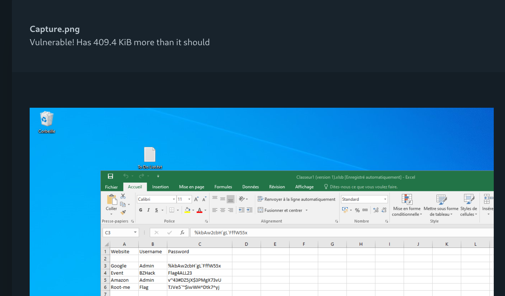

# Capture This

**Difficulty:** Hard  
**Category:** Image  
**Tools:** Ghex, aCropalypse Recovery Tool

---

## 🔍 Initial Analysis


Challenge yêu cầu tìm mật khẩu của KeePass, nhưng trong ảnh không thấy thông tin nào.

Quan sát kỹ góc phải màn hình, ta nhận thấy có chữ **`k`** bị cắt → gợi ý rằng bức ảnh này đã bị crop.

---

## 🛠️ Recovery Attempts

### Using Ghex

Thử khôi phục ảnh bằng **Ghex** (hex editor) nhưng không thành công.

---

## 🔓 aCropalypse Vulnerability

Sau khi đọc writeups, phát hiện một CVE liên quan đến **cropped images** có tên **`aCropalypse`**.

### 📌 What is aCropalypse?

**aCropalypse** (CVE-2023-21036, CVE-2023-28303) là lỗ hổng trong công cụ screenshot của:
- **Windows 11 Snipping Tool**
- **Google Pixel** (Markup tool)

#### 🔬 How it works:

1. User chụp ảnh màn hình
2. Crop ảnh để ẩn thông tin nhạy cảm
3. Lưu lại file ảnh **đè lên file gốc**
4. ❌ **Lỗi**: Phần dữ liệu bị crop **không bị xóa hoàn toàn**
5. ✅ Attacker có thể **khôi phục lại phần ảnh gốc**

> **Note:** Lỗ hổng này xảy ra vì khi save file, tool không truncate file size đúng cách, để lại dữ liệu "rác" chứa nội dung gốc.

---

## 🔍 Vulnerability Detection



Xác định file ảnh bị ảnh hưởng bởi aCropalypse vulnerability.

---

## 🛠️ Recovery Process

### Using aCropalypse Multi-Tool

**Tool:** [Acropalypse-Multi-Tool](https://github.com/frankthetank-music/Acropalypse-Multi-Tool/tree/main)

#### Installation & Usage:

```bash
# Clone repository
git clone https://github.com/frankthetank-music/Acropalypse-Multi-Tool.git
cd Acropalypse-Multi-Tool

# Run recovery
python acropalypse.py Capture.png
```

Tool sẽ cố gắng khôi phục lại phần ảnh gốc trước khi bị crop.

---

## 🔐 Recovered Information

Sau khi khôi phục thành công, phần ảnh bị ẩn sẽ hiển thị mật khẩu KeePass.

---

## 📝 Summary

Challenge này minh họa:
- **aCropalypse vulnerability** trong screenshot tools
- Nguy hiểm của việc crop sensitive information
- Cách khôi phục dữ liệu từ cropped images
- Tầm quan trọng của secure file deletion

**Key Takeaways:**
- Cropping không đảm bảo xóa hoàn toàn thông tin
- Luôn kiểm tra metadata và file structure
- Sử dụng tools chuyên dụng để xóa dữ liệu nhạy cảm
- CVE-2023-21036 & CVE-2023-28303 ảnh hưởng Windows 11 & Google Pixel

---